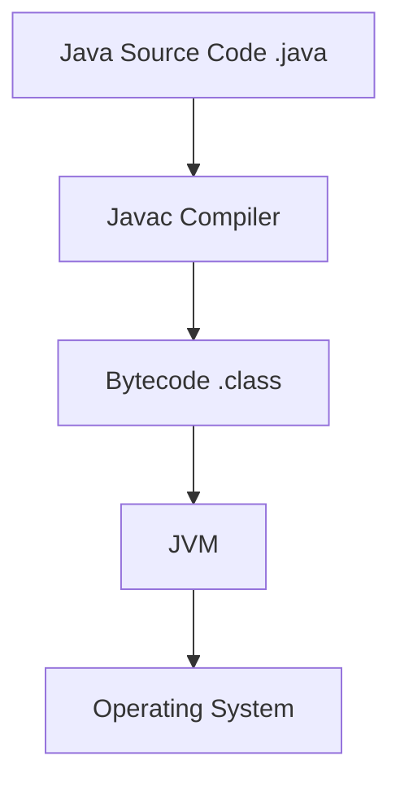
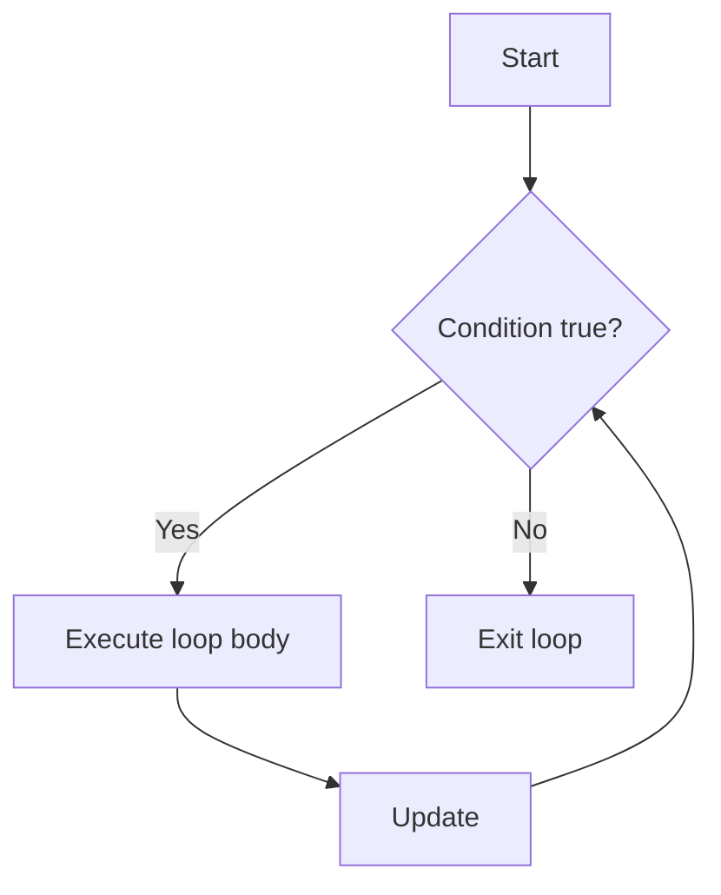
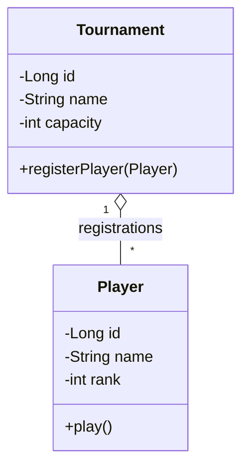
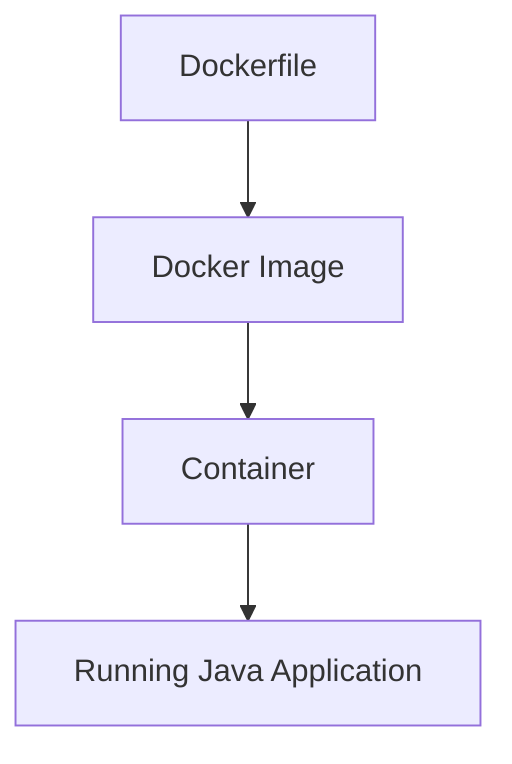
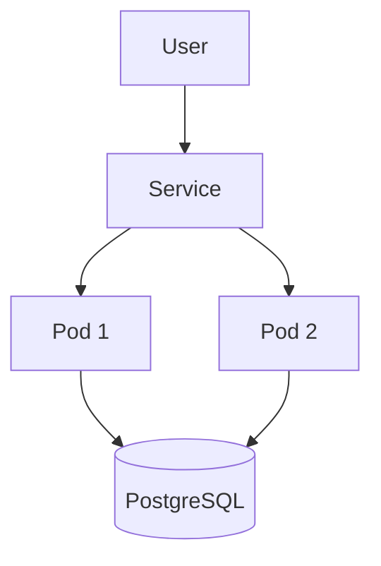
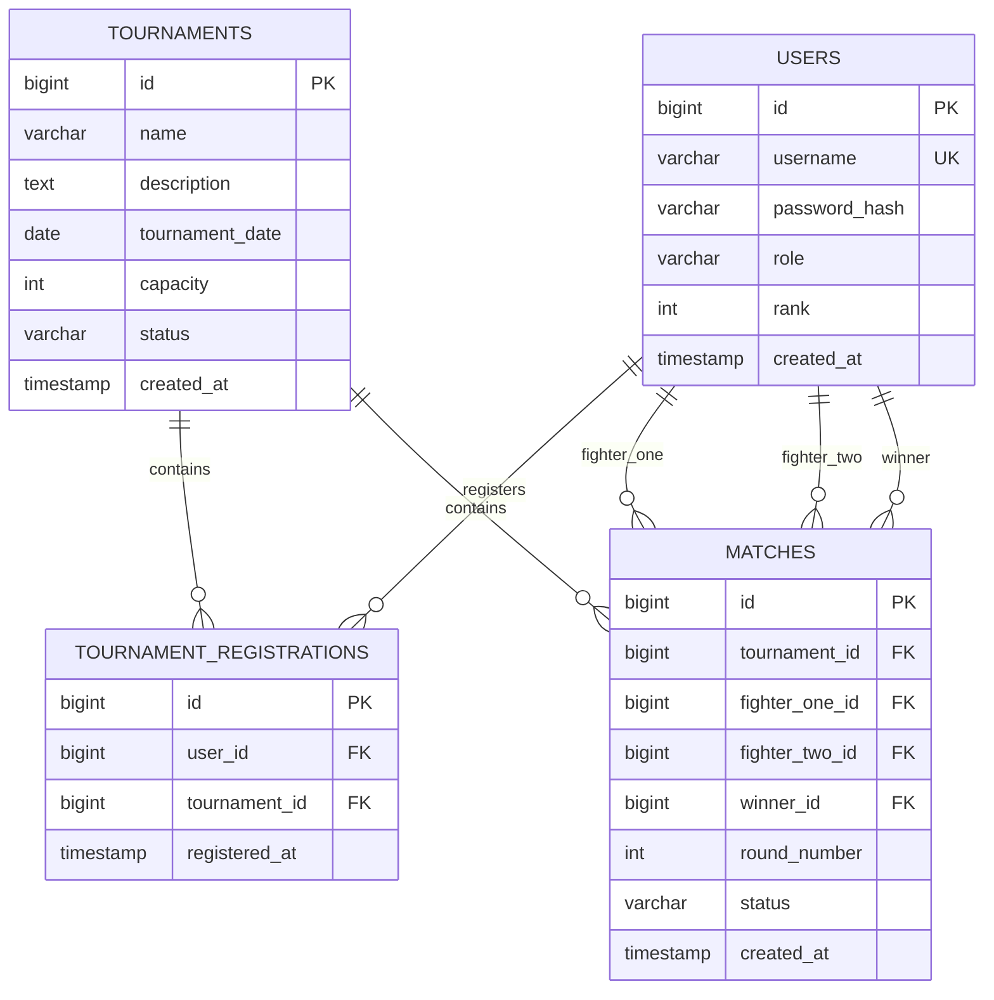

# Java Backend & DevOps Mastery

### From Java Fundamentals to JDBC, PostgreSQL, Docker & Kubernetes

> A progressive learning curriculum, practical exercise workbook, and final project specification for developers moving from PHP/Laravel into Java backend engineering.

---

## Table of Contents

1. [README Introduction](#1-readme-introduction)
2. [What Is Java?](#2-what-is-java)
3. [Installation & First Java Program](#3-installation--first-java-program)
4. [Java Variables & Data Types](#4-java-variables--data-types)
5. [Operators](#5-operators)
6. [Conditions](#6-conditions)
7. [Loops](#7-loops)
8. [Methods](#8-methods)
9. [Strings](#9-strings)
10. [Arrays](#10-arrays)
11. [Object-Oriented Programming](#11-object-oriented-programming)
12. [Enums](#12-enums)
13. [Packages & Project Structure](#13-packages--project-structure)
14. [Exceptions](#14-exceptions)
15. [Collections](#15-collections)
16. [List](#16-list)
17. [Set](#17-set)
18. [Map](#18-map)
19. [Generics](#19-generics)
20. [Date & Time](#20-date--time)
21. [Lambda Expressions](#21-lambda-expressions)
22. [Stream API](#22-stream-api)
23. [File Handling](#23-file-handling)
24. [Maven](#24-maven)
25. [Testing](#25-testing)
26. [Hashing & Salting](#26-hashing--salting)
27. [PostgreSQL](#27-postgresql)
28. [JDBC](#28-jdbc)
29. [Database Connection Management](#29-database-connection-management)
30. [Repository Pattern](#30-repository-pattern)
31. [Service Layer](#31-service-layer)
32. [Transactions](#32-transactions)
33. [Architecture](#33-architecture)
34. [Docker](#34-docker)
35. [Dockerfile](#35-dockerfile)
36. [Docker Compose](#36-docker-compose)
37. [Environment Variables & Secrets](#37-environment-variables--secrets)
38. [Kubernetes](#38-kubernetes)
39. [Kubernetes Exercises](#39-kubernetes-exercises)
40. [Final Project — Dojo Tournament Manager](#40-final-project--dojo-tournament-manager)
41. [Final Roadmap](#final-roadmap)
42. [Final Goal](#-final-goal)

---

# 1. README Introduction

## What is this repository?

This repository is a **complete Java backend learning path**. It is designed to take you from basic Java syntax to a structured backend application using:

- Java 17+
- Object-Oriented Programming
- Collections and Streams
- Maven
- JUnit
- PostgreSQL
- JDBC
- Repository and Service layers
- Secure password storage concepts
- Docker
- Docker Compose
- Kubernetes / Minikube
- Git and GitHub

It is not meant to be a collection of disconnected code snippets. The learning loop is:

```text
Read the concept
      ↓
Understand the mental model
      ↓
Study a small example
      ↓
Solve Easy exercises
      ↓
Solve Medium exercises
      ↓
Solve Hard exercises
      ↓
Reuse the skill in the next section
      ↓
Apply everything in the final project
```

## Who is this for?

This path is especially useful if you already know some web development—particularly PHP, Laravel, JavaScript, SQL, or MVC—but you want to understand Java from the ground up.

You do **not** need to know Java before starting.

## What will you be able to do?

By the end, you should be able to:

- compile and run Java programs;
- explain JVM, JDK, JRE, bytecode, and compilation;
- write clean Java using methods, classes, interfaces, exceptions, generics, collections, lambdas, and streams;
- build and test Maven projects;
- design PostgreSQL schemas;
- write JDBC code safely with `PreparedStatement`;
- separate data access from business rules;
- use transactions correctly;
- store passwords using dedicated password-hashing algorithms;
- containerize the application with Docker;
- run the Java app and PostgreSQL together with Docker Compose;
- deploy the final project locally with Kubernetes and Minikube.

## Prerequisites

Recommended knowledge:

- basic programming logic;
- variables, conditions, and loops in any language;
- basic terminal usage;
- basic Git commands.

Helpful but not required:

- PHP/Laravel experience;
- SQL experience;
- Docker experience.

## Required software

- **JDK 17 or newer**
- **IDE:** IntelliJ IDEA, VS Code with Java extensions, or Eclipse
- **Maven**
- **PostgreSQL**
- **pgAdmin** or `psql`
- **Docker Desktop** or Docker Engine
- **kubectl**
- **Minikube**
- **Git**
- **GitHub account**

## PHP/Laravel vs Java

| Concept | PHP/Laravel | Java |
|---|---|---|
| Language | PHP | Java |
| Runtime | PHP Runtime | JVM |
| Package manager | Composer | Maven |
| Dependency file | `composer.json` | `pom.xml` |
| ORM | Eloquent | JPA/Hibernate |
| DB low-level API | PDO | JDBC |
| Exceptions | PHP exceptions | Java exceptions |
| Collections | Arrays | `List` / `Set` / `Map` |
| Framework | Laravel | Spring Boot |
| Build | Composer scripts / tooling | Maven lifecycle |
| Container | Docker | Docker |

### Important database vocabulary

```text
JDBC → low-level database API
JPA/Hibernate → ORM
Spring Data JPA → abstraction on top of JPA
```

JDBC is conceptually closer to **PDO** than to Eloquent. You write SQL, bind parameters, execute queries, and manually map database rows to Java objects.

### 📚 Resources

- Oracle Java Documentation: https://docs.oracle.com/en/java/
- OpenJDK: https://openjdk.org/
- Apache Maven: https://maven.apache.org/
- PostgreSQL Documentation: https://www.postgresql.org/docs/
- Docker Documentation: https://docs.docker.com/
- Kubernetes Documentation: https://kubernetes.io/docs/
- Git Documentation: https://git-scm.com/doc

---

# Course Roadmap

```text
LEVEL 01
Java Fundamentals
     ↓
LEVEL 02
Object-Oriented Programming
     ↓
LEVEL 03
Collections & Streams
     ↓
LEVEL 04
Maven & Testing
     ↓
LEVEL 05
PostgreSQL & SQL
     ↓
LEVEL 06
JDBC & Architecture
     ↓
LEVEL 07
Security
     ↓
LEVEL 08
Docker
     ↓
LEVEL 09
Docker Compose
     ↓
LEVEL 10
Kubernetes
     ↓
🏆 FINAL PROJECT
Dojo Tournament Manager
```

---

# 2. What Is Java?

## 2.1 What is Java?

Java is both:

1. a **programming language**;
2. an ecosystem built around the **Java Virtual Machine (JVM)**.

Java source code is stored in `.java` files. The Java compiler (`javac`) compiles that source code into **bytecode**, usually stored in `.class` files. The JVM executes that bytecode.



## JDK vs JRE vs JVM

### JVM

The **Java Virtual Machine** executes Java bytecode.

Mental model:

```text
.class file
   ↓
 JVM
   ↓
Machine instructions
```

### JRE

The **Java Runtime Environment** is the runtime environment required to execute Java applications. Historically, JRE distributions were commonly installed separately. Modern JDK distributions usually include the runtime components needed to run Java applications.

### JDK

The **Java Development Kit** contains the tools developers need to build Java software, including:

- `javac`
- `java`
- `javadoc`
- debugging and diagnostic tools
- Java runtime components

For development, install a **JDK**.

## What happens with `javac Main.java`?

```bash
javac Main.java
```

1. `javac` reads `Main.java`.
2. It checks the syntax and types.
3. If compilation succeeds, it produces bytecode.
4. You normally get `Main.class`.

Then:

```bash
java Main
```

The `java` launcher starts the JVM and asks it to execute the `Main` class.

## Why does Java use bytecode?

Bytecode provides a portable intermediate representation.

```text
Java source
    ↓
Bytecode
    ↓
Windows JVM / Linux JVM / macOS JVM
```

The JVM implementation is platform-specific, but the `.class` bytecode format is portable.

## Common mistakes

- Thinking Java source is executed directly.
- Confusing `java` with `javac`.
- Calling the JVM a compiler.
- Assuming `.class` files are human-readable source files.

### Easy Exercise

#### Objective

Explain the Java execution pipeline in your own words.

#### TODOs

```text
TODO 2.1
1. Define JDK.
2. Define JVM.
3. Define bytecode.
4. Explain what javac does.
5. Explain what java Main does.
```

#### Expected result

You can explain the path from `Main.java` to program execution without memorizing a definition word-for-word.

### Medium Exercise

Draw the compilation process yourself using ASCII or Mermaid.

### Hard Exercise

Compile a class manually and inspect the generated `.class` file name. Then deliberately introduce a syntax error and describe at which stage execution stops.

### Verification Checklist

- [ ] I can explain JDK vs JVM.
- [ ] I know what bytecode is.
- [ ] I know the difference between `javac` and `java`.
- [ ] I understand why Java is portable across operating systems.

### 📚 Resources

- Oracle Java Documentation: https://docs.oracle.com/en/java/
- OpenJDK: https://openjdk.org/
- Java Language Specification: https://docs.oracle.com/javase/specs/

---

# 3. Installation & First Java Program

## What do I install?

Install a JDK, then verify:

```bash
java --version
javac --version
```

You should see compatible versions for both commands.

## `JAVA_HOME`

`JAVA_HOME` points tools to your JDK installation.

Example mental model:

```text
JAVA_HOME
   ↓
C:\Program Files\Java\jdk-...
or
/usr/lib/jvm/...
```

`PATH` determines whether commands such as `java`, `javac`, and `mvn` can be executed without writing their full path.

## IDE vs terminal

An IDE helps with:

- autocomplete;
- refactoring;
- debugging;
- project navigation.

The terminal helps you understand what is really happening:

- compilation;
- execution;
- Maven commands;
- Git;
- Docker;
- Kubernetes.

Learn both.

## First project

```text
java-learning/
└── src/
    └── Main.java
```

`Main.java`:

```java
public class Main {
    public static void main(String[] args) {
        System.out.println("Hello Java!");
    }
}
```

## Line-by-line explanation

### `public`

The class or method can be accessed from outside its declaring scope where Java's access rules allow it.

### `class`

Declares a class.

### `Main`

The class name. Because it is declared `public`, the file should be named `Main.java`.

### `static`

`main` belongs to the class itself. The JVM can call it without first creating a `Main` object.

### `void`

The method does not return a value.

### `main`

The standard entry point used by the Java launcher.

### `String[]`

An array of `String` objects.

### `args`

The variable that receives command-line arguments.

### `System`

A standard Java class.

### `out`

A static field representing the standard output stream.

### `println`

Prints text followed by a newline.

## Compile and run

From inside `src`:

```bash
javac Main.java
java Main
```

Expected output:

```text
Hello Java!
```

### Easy Exercise

#### Objective

Print simple information.

#### TODOs

```java
// TODO 3.1:
// Print your name.

// TODO 3.2:
// Print your age.

// TODO 3.3:
// Print three separate lines.
```

### Medium Exercise

Create a console profile containing:

- name;
- city;
- favorite language;
- current learning goal.

### Hard Exercise

Create a console introduction program that stores profile values in variables and prints a formatted result.

### Verification Checklist

- [ ] `java --version` works.
- [ ] `javac --version` works.
- [ ] I can compile a `.java` file.
- [ ] I can run a compiled class.
- [ ] I can explain each part of `public static void main(String[] args)`.

### 📚 Resources

- Dev.java Learn: https://dev.java/learn/
- Oracle Java Documentation: https://docs.oracle.com/en/java/

---

# 4. Java Variables & Data Types

## What is a variable?

A variable associates a name with a value of a specific type.

```java
int age = 21;
```

Read this as:

```text
type: int
name: age
value: 21
```

## Primitive types

| Type | Typical size | Represents | Example |
|---|---:|---|---|
| `byte` | 8-bit | very small integers | `byte level = 10;` |
| `short` | 16-bit | small integers | `short year = 2026;` |
| `int` | 32-bit | normal whole numbers | `int score = 200;` |
| `long` | 64-bit | very large whole numbers | `long views = 8_000_000_000L;` |
| `float` | 32-bit | decimal, lower precision | `float rate = 1.5F;` |
| `double` | 64-bit | decimal, common default | `double price = 149.99;` |
| `char` | 16-bit UTF-16 code unit | one character | `char grade = 'A';` |
| `boolean` | JVM-dependent representation | `true` or `false` | `boolean active = true;` |

Examples:

```java
int age = 21;
double price = 149.99;
boolean active = true;
char grade = 'A';
long population = 1_000_000L;
```

## Literals and suffixes

Java treats whole-number literals as `int` by default when they fit. Use `L` for a `long` literal:

```java
long bigNumber = 9_000_000_000L;
```

Decimal literals are `double` by default. Use `F` for `float`:

```java
float ratio = 1.5F;
```

## `String` is not primitive

```java
String username = "Oussama";
```

`String` is a class and therefore a **reference type**.

### Mental model

```text
Primitive variable
age ─────► 21

Reference variable
username ─────► String object "Oussama"
```

The model above is intentionally simplified. It is meant to help distinguish “the value itself” from “a reference to an object.”

## Type conversion

Implicit widening:

```java
int score = 100;
long total = score;
```

Explicit narrowing:

```java
double price = 49.95;
int roundedDown = (int) price;
```

The second operation loses the fractional part.

## Common mistakes

- Using `float` without the `F` suffix.
- Forgetting `L` for large `long` literals.
- Thinking `String` is primitive.
- Narrowing a numeric value without considering data loss.

### Easy Exercise

Create variables for a fighter:

```java
// TODO 4.1:
// Store:
// - id
// - username
// - rank
// - active status
// - rating
```

### Medium Exercise

Convert an `int` to `double` and a `double` to `int`. Print both results and explain any information loss.

### Hard Exercise

Build a “fighter profile” program that stores multiple values, performs at least one conversion, and prints a formatted summary.

### Verification Checklist

- [ ] I know all primitive types.
- [ ] I know that `String` is a reference type.
- [ ] I understand widening vs narrowing.
- [ ] I know when `L` and `F` suffixes are needed.

### 📚 Resources

- Dev.java Language Basics: https://dev.java/learn/language-basics/
- Java Language Specification: https://docs.oracle.com/javase/specs/

---

# 5. Operators

## Why operators exist

Operators let you calculate values, compare data, update variables, and combine boolean conditions.

## Arithmetic

```java
+  -  *  /  %
```

Example:

```java
int total = 10 + 5;
int remainder = 10 % 3;
```

## Assignment

```java
=
+=
-=
*=
/=
%=
```

```java
int score = 10;
score += 5;
```

## Comparison

```java
==
!=
>
<
>=
<=
```

A comparison produces a `boolean`.

## Logical operators

```java
&&
||
!
```

```java
boolean canJoin = age >= 18 && accountActive;
```

## Increment and decrement

```java
count++;
count--;
```

## Ternary operator

```java
String label = score >= 50 ? "PASS" : "FAIL";
```

Use it for small expressions. Avoid deeply nested ternary expressions.

## Operator precedence

Multiplication and division generally happen before addition and subtraction.

```java
int result = 2 + 3 * 4; // 14
```

Use parentheses when they improve clarity:

```java
int result = (2 + 3) * 4; // 20
```

### Easy Exercise

#### Objective

Practice calculations.

#### Given data

```text
price = 120
quantity = 3
```

#### TODOs

```java
// TODO 5.1:
// Calculate subtotal.

// TODO 5.2:
// Calculate a 10% discount.

// TODO 5.3:
// Print final price.
```

### Medium Exercise

Build an age and discount calculator. Apply a discount only when the customer matches your chosen eligibility rules.

### Hard Exercise

Build a billing calculation engine with:

- subtotal;
- discount;
- tax;
- shipping;
- final total.

### Verification Checklist

- [ ] I can use arithmetic operators.
- [ ] I understand comparison results.
- [ ] I can combine conditions with `&&` and `||`.
- [ ] I can use `%` for divisibility logic.
- [ ] I use parentheses when precedence might be unclear.

### 📚 Resources

- Dev.java Operators: https://dev.java/learn/language-basics/

---

# 6. Conditions

Conditions let a program choose which code should run.

## `if`, `else if`, `else`

```java
if (score >= 90) {
    System.out.println("Excellent");
} else if (score >= 60) {
    System.out.println("Passed");
} else {
    System.out.println("Failed");
}
```

Use this when decisions depend on ranges or complex boolean expressions.

## Traditional `switch`

```java
switch (role) {
    case "ADMIN":
        System.out.println("Admin dashboard");
        break;
    case "FIGHTER":
        System.out.println("Fighter dashboard");
        break;
    default:
        System.out.println("Unknown role");
}
```

## Switch expression

Modern Java can return a value from a switch:

```java
String message = switch (role) {
    case "ADMIN" -> "Admin dashboard";
    case "FIGHTER" -> "Fighter dashboard";
    default -> "Unknown role";
};
```

Use a switch when you are matching one value against clear alternatives.

## Common mistakes

- Forgetting braces in code that is likely to grow.
- Using `==` to compare `String` content.
- Writing conditions that can never be reached.
- Nesting too many `if` blocks instead of extracting methods.

### Easy Exercise

- Determine whether a number is positive, negative, or zero.
- Determine whether a number is even or odd.

### Medium Exercise

Build a grade calculator.

### Hard Exercise

Build a console authentication decision system that evaluates:

- user exists;
- password matches;
- account is active;
- role controls which dashboard message is shown.

### Verification Checklist

- [ ] I can write `if/else`.
- [ ] I know when `switch` is clearer.
- [ ] I can combine multiple conditions.
- [ ] I can avoid unreachable condition branches.

### 📚 Resources

- Dev.java Control Flow: https://dev.java/learn/language-basics/

---

# 7. Loops

Loops repeat work.

## `for`

Best when you know the number of iterations.

```java
for (int i = 0; i < 5; i++) {
    System.out.println(i);
}
```

## `while`

Best when the number of repetitions depends on a condition.

```java
while (running) {
    // keep processing
}
```

## `do while`

Runs the body at least once.

```java
do {
    // menu
} while (running);
```

## Enhanced `for`

Used to iterate through arrays and collections:

```java
for (String name : names) {
    System.out.println(name);
}
```

## `break`

Stops the nearest loop.

## `continue`

Skips the rest of the current iteration.

### Loop flow



### Easy Exercise

- Print `1` to `100`.
- Sum numbers from `1` to `100`.
- Print a multiplication table.

### Medium Exercise

- Build a number guessing game.
- Build a prime-number checker.

### Hard Exercise

Build a console menu that continues until the user chooses Exit.

### Verification Checklist

- [ ] I know the difference between `for`, `while`, and `do while`.
- [ ] I can use enhanced `for`.
- [ ] I understand `break` and `continue`.
- [ ] I can avoid accidental infinite loops.

### 📚 Resources

- Dev.java Control Flow: https://dev.java/learn/language-basics/

---

# 8. Methods

## Why methods exist

Methods package behavior into reusable units.

They improve:

- readability;
- reuse;
- testing;
- separation of responsibilities.

Example:

```java
public static int add(int a, int b) {
    return a + b;
}
```

Line by line:

- `public`: access modifier.
- `static`: belongs to the class rather than an instance.
- `int`: return type.
- `add`: method name.
- `(int a, int b)`: parameters.
- `return a + b;`: sends an `int` back to the caller.

## `void`

Use `void` when the method does not return a value:

```java
public static void printWelcome() {
    System.out.println("Welcome");
}
```

## Scope

A local variable only exists inside its block:

```java
public static void demo() {
    int score = 10;
}
// score is not available here
```

## Method overloading

Same method name, different parameter list:

```java
static int add(int a, int b) {
    return a + b;
}

static double add(double a, double b) {
    return a + b;
}
```

## `static`

Use `static` when behavior truly belongs to the class or is a stateless utility. Do not make everything static just to avoid creating objects.

### Easy Exercise

Create methods:

```java
// TODO 8.1:
// greet(String name)

// TODO 8.2:
// add(int a, int b)

// TODO 8.3:
// isAdult(int age)
```

### Medium Exercise

Build a calculator using one method per operation.

### Hard Exercise

Refactor a large menu program so input handling, validation, calculations, and printing are separated into methods.

### Verification Checklist

- [ ] I can create parameters.
- [ ] I can return values.
- [ ] I know when to use `void`.
- [ ] I understand local scope.
- [ ] I understand overloading.
- [ ] I do not use `static` automatically.

### 📚 Resources

- Dev.java Methods: https://dev.java/learn/classes-objects/

---

# 9. Strings

`String` represents text.

```java
String username = "Oussama";
```

## Strings are immutable

An immutable object does not change its internal value after creation.

```java
String name = "Ali";
name = name.toUpperCase();
```

The original `String` value is not modified in place; a new result is produced and the variable is reassigned.

## Common methods

```java
length()
contains()
equals()
equalsIgnoreCase()
substring()
toUpperCase()
toLowerCase()
trim()
split()
replace()
```

Example:

```java
String username = "  Oussama  ";
String clean = username.trim().toLowerCase();
```

## Why `==` is wrong for String content

This:

```java
name == "Oussama"
```

compares references, not String content.

Use:

```java
name.equals("Oussama")
```

Safer when the variable may be `null`:

```java
"Oussama".equals(name)
```

## `StringBuilder`

Repeated String concatenation can create many temporary objects.

For repeated modification:

```java
StringBuilder builder = new StringBuilder();
builder.append("Dojo");
builder.append(" Tournament");
String result = builder.toString();
```

### Easy Exercise

Normalize a username with `trim()` and `toLowerCase()`.

### Medium Exercise

Split a comma-separated list of fighter names and print each clean name.

### Hard Exercise

Build a formatted tournament report using `StringBuilder`.

### Verification Checklist

- [ ] I use `.equals()` for String content.
- [ ] I understand immutability.
- [ ] I know useful String methods.
- [ ] I know when `StringBuilder` is appropriate.

### 📚 Resources

- Java API — String: https://docs.oracle.com/en/java/javase/17/docs/api/java.base/java/lang/String.html
- Java API — StringBuilder: https://docs.oracle.com/en/java/javase/17/docs/api/java.base/java/lang/StringBuilder.html

---

# 10. Arrays

An array stores a fixed number of elements of one type.

```java
int[] numbers;
```

Create it:

```java
numbers = new int[5];
```

Or initialize directly:

```java
int[] numbers = {10, 20, 30, 40};
```

## Index

Arrays are zero-indexed:

```text
index:  0   1   2   3
value: 10  20  30  40
```

## Length

```java
System.out.println(numbers.length);
```

Note: arrays use the field `.length`, while `String` uses the method `.length()`.

## Iterate

```java
for (int number : numbers) {
    System.out.println(number);
}
```

## Multidimensional arrays

```java
int[][] grid = {
    {1, 2},
    {3, 4}
};
```

### Easy Exercise

Find the maximum number in an array.

### Medium Exercise

Calculate the average of an array.

### Hard Exercise

Create a small statistics program that calculates:

- minimum;
- maximum;
- average;
- count above average.

### Verification Checklist

- [ ] I understand fixed length.
- [ ] I know array indexes start at 0.
- [ ] I can iterate with both normal and enhanced `for`.
- [ ] I can use a 2D array.

### 📚 Resources

- Dev.java Arrays: https://dev.java/learn/language-basics/

---

# 🏁 CHECKPOINT 1 — JAVA FUNDAMENTALS

Before continuing, you should be able to:

- [ ] Explain JVM vs JDK vs JRE.
- [ ] Compile and run a Java program.
- [ ] Use primitive data types.
- [ ] Use `String`.
- [ ] Write conditions.
- [ ] Write loops.
- [ ] Create methods.
- [ ] Work with arrays.
- [ ] Explain why `.equals()` is used for String content.

---

# 11. Object-Oriented Programming

OOP is one of the most important parts of Java.

## Class vs object

```text
Class  = blueprint
Object = actual thing created from that blueprint
```

House analogy:

```text
House blueprint → class
Actual house    → object
```

Java example:

```java
public class Player {
    private Long id;
    private String name;
    private int rank;
}
```

Create an object:

```java
Player player = new Player();
```

## Attributes / fields

Fields store object state:

```java
private String name;
private int rank;
```

## Methods

Methods represent behavior:

```java
public void play() {
    System.out.println("Player is playing");
}
```

## Constructor

A constructor initializes an object.

```java
public Player(Long id, String name, int rank) {
    this.id = id;
    this.name = name;
    this.rank = rank;
}
```

## `this`

`this` refers to the current object.

```java
this.name = name;
```

The left `name` is the field. The right `name` is the parameter.

## Encapsulation

Encapsulation protects internal state and exposes controlled operations.

```java
public class Player {
    private int rank;

    public int getRank() {
        return rank;
    }

    public void setRank(int rank) {
        if (rank < 0) {
            throw new IllegalArgumentException("Rank cannot be negative");
        }
        this.rank = rank;
    }
}
```

## Access modifiers

| Modifier | Typical visibility |
|---|---|
| `public` | everywhere |
| `protected` | package + subclasses |
| no modifier | package-private |
| `private` | same class only |

## Inheritance

Inheritance models an “is-a” relationship.

```java
public class User {
    protected String username;
}

public class Admin extends User {
}
```

Do not use inheritance merely to reuse code. Prefer it when the subtype truly represents a specialized form of the parent type.

## Polymorphism

Polymorphism lets different implementations be treated through a common type.

```java
public interface NotificationService {
    void send(String message);
}
```

```java
public class EmailNotificationService implements NotificationService {
    @Override
    public void send(String message) {
        System.out.println("Email: " + message);
    }
}
```

## Abstraction

Abstraction exposes what an object can do while hiding unnecessary internal details.

## Interfaces

An interface describes a contract.

```java
public interface PlayerRepository {
    Player save(Player player);
}
```

Use interfaces when callers should depend on behavior rather than a specific implementation.

## Abstract classes

An abstract class can combine:

- abstract methods;
- concrete methods;
- fields;
- constructors.

```java
public abstract class User {
    private final String username;

    protected User(String username) {
        this.username = username;
    }

    public String getUsername() {
        return username;
    }

    public abstract String getDashboardTitle();
}
```

## Interface vs abstract class

Use an interface when the main goal is a capability or contract.

Use an abstract class when related subclasses share meaningful state or implementation.

## UML



## Common mistakes

- Making fields public.
- Putting unrelated responsibilities inside one class.
- Creating getters/setters automatically without thinking about invariants.
- Overusing inheritance.
- Making every method static.
- Creating a “God class” that handles UI, SQL, validation, and business logic.

### Easy Exercise

Create a `Player` class with:

- `id`;
- `name`;
- `rank`;
- constructor;
- getters;
- one behavior method.

### Medium Exercise

Create:

```text
Player
Tournament
Match
```

Define clear relationships between them.

### Hard Exercise

Build a small in-memory tournament domain using:

- encapsulation;
- at least one interface;
- at least one enum;
- polymorphism where it makes sense.

### Verification Checklist

- [ ] I can explain class vs object.
- [ ] I use constructors.
- [ ] I understand `this`.
- [ ] I understand encapsulation.
- [ ] I understand inheritance.
- [ ] I understand polymorphism.
- [ ] I understand abstraction.
- [ ] I can explain interface vs abstract class.

### 📚 Resources

- Dev.java Classes and Objects: https://dev.java/learn/classes-objects/
- Refactoring.Guru Design Patterns: https://refactoring.guru/design-patterns

---

# 12. Enums

Enums represent a fixed set of valid values.

```java
public enum UserRole {
    ADMIN,
    FIGHTER
}
```

Instead of:

```java
String role = "admn";
```

use:

```java
UserRole role = UserRole.ADMIN;
```

This prevents invalid arbitrary values and improves readability.

Other examples:

```java
public enum RoomStatus {
    AVAILABLE,
    OCCUPIED,
    CLOSED
}
```

```java
public enum PaymentStatus {
    PENDING,
    PAID,
    FAILED,
    REFUNDED
}
```

### Easy Exercise

Create `UserRole`.

### Medium Exercise

Create `TournamentStatus` and use it in a `Tournament` class.

### Hard Exercise

Create a state-validation method that prevents a `COMPLETED` tournament from returning directly to `OPEN`.

### Verification Checklist

- [ ] I know when a value should be an enum.
- [ ] I understand why enums are safer than random strings.
- [ ] I can use enums in conditions and switch expressions.

### 📚 Resources

- Java Language Specification — Enums: https://docs.oracle.com/javase/specs/

---

# 13. Packages & Project Structure

Packages act as namespaces and normally match the directory structure.

```text
src/
└── main/
    └── java/
        └── com/
            └── dojo/
                ├── model/
                ├── repository/
                ├── service/
                └── ui/
```

A class inside:

```text
src/main/java/com/dojo/model/User.java
```

would normally begin with:

```java
package com.dojo.model;
```

## Imports

This is wrong:

```java
import ./com/main/java/model/User.java;
```

Java imports names, not filesystem paths.

Correct:

```java
import com.dojo.model.User;
```

## Why structure matters

A professional structure helps keep responsibilities separate:

```text
model       → domain objects
repository  → data access
service     → business rules
ui          → user interaction
```

### Easy Exercise

Create a package structure with `model`, `repository`, `service`, and `ui`.

### Medium Exercise

Move an existing multi-class program into packages and fix imports.

### Hard Exercise

Create a Maven-compatible package tree for the future final project.

### Verification Checklist

- [ ] I understand `package`.
- [ ] I know imports use fully qualified class names.
- [ ] My directory structure matches the package structure.
- [ ] I know why layered folders exist.

### 📚 Resources

- Dev.java Packages: https://dev.java/learn/packages/

---

# 14. Exceptions

An exception represents an abnormal condition that interrupts normal flow.

## Checked vs unchecked

### Checked exceptions

The compiler requires you to handle or declare them.

Example: some I/O operations.

### Unchecked exceptions

Typically subclasses of `RuntimeException`. They often represent programming or business-rule failures.

## `try` / `catch`

```java
try {
    int value = Integer.parseInt(input);
} catch (NumberFormatException e) {
    System.out.println("Invalid number");
}
```

## `finally`

`finally` is intended for cleanup that must run regardless of success or failure. Modern Java often reduces the need for manual cleanup by using try-with-resources.

## `throw`

Creates and throws an exception:

```java
throw new IllegalArgumentException("Capacity must be positive");
```

## `throws`

Declares that a method may propagate a checked exception:

```java
public String readFile(Path path) throws IOException {
    return Files.readString(path);
}
```

## Custom exception

```java
public class UserNotFoundException extends RuntimeException {
    public UserNotFoundException(String message) {
        super(message);
    }
}
```

Use a custom business exception when it gives meaningful domain information.

Examples:

- `TournamentFullException`
- `DuplicateRegistrationException`
- `TournamentNotOpenException`

### Easy Exercise

Catch invalid numeric input.

### Medium Exercise

Create `TournamentFullException`.

### Hard Exercise

Build a registration service that throws different custom exceptions for:

- missing fighter;
- missing tournament;
- duplicate registration;
- tournament not open;
- tournament full.

### Verification Checklist

- [ ] I understand exception flow.
- [ ] I know checked vs unchecked at a conceptual level.
- [ ] I can use `throw`.
- [ ] I understand `throws`.
- [ ] I can create a custom business exception.

### 📚 Resources

- Dev.java Exceptions: https://dev.java/learn/exceptions/

---

# 🏁 CHECKPOINT 2 — OOP

Before continuing:

- [ ] Create classes and objects.
- [ ] Use constructors.
- [ ] Encapsulate fields.
- [ ] Use packages.
- [ ] Use enums.
- [ ] Use inheritance only where it fits.
- [ ] Use interfaces.
- [ ] Explain polymorphism.
- [ ] Create and handle exceptions.

---

# 15. Collections

Collections store groups of objects dynamically.

High-level view:

```text
Collection
├── List
├── Set
└── Queue

Map  ← separate hierarchy
```

Use the data structure that matches the problem.

| Need | Good starting point |
|---|---|
| ordered elements, duplicates allowed | `List` |
| unique elements | `Set` |
| key → value lookup | `Map` |
| first-in-first-out processing | `Queue` |

## Common mistakes

- Using `List` when uniqueness is required.
- Assuming `HashMap` is ordered.
- Modifying a collection incorrectly while iterating.
- Choosing a structure by habit instead of requirements.

### Easy Exercise

Write one real backend use case for `List`, `Set`, and `Map`.

### Medium Exercise

Model tournament data using all three.

### Hard Exercise

Explain why the same domain might use:

```text
List<Match>
Set<String>
Map<Long, Player>
```

for different needs.

### Verification Checklist

- [ ] I know List vs Set vs Map.
- [ ] I understand that Map is not a subtype of Collection.
- [ ] I can choose structures based on requirements.

### 📚 Resources

- Java Collections Framework: https://docs.oracle.com/en/java/javase/17/docs/api/java.base/java/util/package-summary.html

---

# 16. List

```java
List<Player> players = new ArrayList<>();
```

A `List`:

- preserves element order;
- allows duplicates;
- supports indexed access.

Common methods:

```java
add()
get()
set()
remove()
contains()
size()
isEmpty()
clear()
```

Example:

```java
List<String> names = new ArrayList<>();
names.add("Ali");
names.add("Sara");

System.out.println(names.get(0));
```

## `ArrayList` vs `LinkedList`

### `ArrayList`

Good general-purpose default for most application code.

Conceptually backed by a resizable array.

### `LinkedList`

Uses linked nodes. It can be useful for certain insertion/removal patterns and queue-like behavior, but it is **not automatically faster** than `ArrayList`.

Choose based on actual operations, not folklore.

### Easy Exercise

```java
// TODO 16.1:
// 1. Create List<Player>.
// 2. Add 5 players.
// 3. Print all players.
// 4. Print player at index 2.
// 5. Remove one player.
// 6. Print final list.
```

### Medium Exercise

Create a tournament registration list with capacity validation.

### Hard Exercise

Create an in-memory bracket using ordered lists of matches.

### Verification Checklist

- [ ] I can create `List<T>`.
- [ ] I know duplicates are allowed.
- [ ] I can access by index.
- [ ] I understand `ArrayList` conceptually.

### 📚 Resources

- Java API — List: https://docs.oracle.com/en/java/javase/17/docs/api/java.base/java/util/List.html
- Java API — ArrayList: https://docs.oracle.com/en/java/javase/17/docs/api/java.base/java/util/ArrayList.html

---

# 17. Set

```java
Set<String> usernames = new HashSet<>();
```

A `Set` is designed around uniqueness.

```java
usernames.add("ali");
usernames.add("ali");
```

The second equal value does not create a duplicate entry.

Useful examples:

```text
unique usernames
unique participants
unique tags
unique permissions
```

Common methods:

```java
add()
remove()
contains()
size()
isEmpty()
clear()
```

## Important note about equality

For your own classes, `Set` uniqueness depends on equality behavior. Later, learn how `equals()` and `hashCode()` work together.

### Easy Exercise

Store unique usernames.

### Medium Exercise

Prevent duplicate tournament participant IDs using a `Set<Long>`.

### Hard Exercise

Create a `Set<Player>` and investigate what happens before and after correctly implementing `equals()` and `hashCode()`.

### Verification Checklist

- [ ] I know why Set exists.
- [ ] I understand uniqueness.
- [ ] I know `HashSet` does not promise insertion order.
- [ ] I know custom object equality matters.

### 📚 Resources

- Java API — Set: https://docs.oracle.com/en/java/javase/17/docs/api/java.base/java/util/Set.html
- Java API — HashSet: https://docs.oracle.com/en/java/javase/17/docs/api/java.base/java/util/HashSet.html

---

# 18. Map

A Map stores **key → value** pairs.

```java
Map<Long, Player> players = new HashMap<>();
```

Example:

```text
101 → Player("Oussama")
102 → Player("Ali")
103 → Player("Yassine")
```

## Common operations

```java
put()
get()
getOrDefault()
containsKey()
containsValue()
remove()
replace()
putIfAbsent()
keySet()
values()
entrySet()
```

Example:

```java
players.put(101L, player);
Player found = players.get(101L);
```

## Iteration

```java
for (Map.Entry<Long, Player> entry : players.entrySet()) {
    Long id = entry.getKey();
    Player player = entry.getValue();

    System.out.println(id + " -> " + player.getName());
}
```

## Real backend use cases

```text
user ID → User
room number → Room
product ID → Product
configuration key → value
cache key → object
```

## HashMap vs LinkedHashMap vs TreeMap

### `HashMap`

Good general-purpose key/value structure. Average lookup is usually very fast.

### `LinkedHashMap`

Maintains a predictable iteration order, commonly insertion order.

### `TreeMap`

Keeps keys sorted according to natural order or a comparator.

## Big-O, accessible version

For a well-behaved `HashMap`, basic lookup such as `get(key)` is typically **O(1) average-case**.

That means lookup time does not normally grow linearly with the number of elements.

A `TreeMap` generally performs key-based operations in **O(log n)**.

Do not reduce performance decisions to Big-O alone. Memory use, ordering, key quality, and workload also matter.

### Easy Exercise

Create:

```text
Student ID → Student
```

### Medium Exercise

Create:

```text
Tournament ID → Tournament
```

with add, find, update, and remove operations.

### Hard Exercise

Build an in-memory repository:

```java
Map<Long, Player>
```

Requirements:

```java
// TODO 18.1:
// Add a player only if the ID is not already used.

// TODO 18.2:
// Find by ID.

// TODO 18.3:
// Return all players as a List.

// TODO 18.4:
// Delete by ID.

// TODO 18.5:
// Throw a clear exception when appropriate.
```

### Verification Checklist

- [ ] I understand key → value.
- [ ] I can iterate with `entrySet()`.
- [ ] I know `HashMap` is not sorted.
- [ ] I know why maps are useful for repositories and caches.
- [ ] I understand average O(1) lookup at a high level.

### 📚 Resources

- Java API — Map: https://docs.oracle.com/en/java/javase/17/docs/api/java.base/java/util/Map.html
- Java API — HashMap: https://docs.oracle.com/en/java/javase/17/docs/api/java.base/java/util/HashMap.html

---

# 19. Generics

Generics provide type safety.

```java
List<Player>
Map<Long, Player>
Set<String>
```

Without generics, collections could contain unrelated object types and require unsafe casts.

## Generic type parameter

```java
public class Box<T> {
    private T value;

    public void set(T value) {
        this.value = value;
    }

    public T get() {
        return value;
    }
}
```

Use it:

```java
Box<String> box = new Box<>();
box.set("Java");
```

## Why generics matter in backend code

They are everywhere:

- collections;
- repositories;
- `Optional<T>`;
- test utilities;
- framework APIs.

### Easy Exercise

Create `Box<T>`.

### Medium Exercise

Create a generic `Pair<K, V>`.

### Hard Exercise

Design a generic in-memory repository interface:

```java
public interface Repository<ID, T> {
    T save(T entity);
    Optional<T> findById(ID id);
    List<T> findAll();
    void deleteById(ID id);
}
```

### Verification Checklist

- [ ] I understand `<T>`.
- [ ] I know why generics improve type safety.
- [ ] I can read generic method and interface signatures.

### 📚 Resources

- Dev.java Generics: https://dev.java/learn/generics/

---

# 20. Date & Time

Prefer the modern `java.time` API.

Important types:

```java
LocalDate
LocalTime
LocalDateTime
Instant
Duration
Period
```

## `LocalDate`

A date without time:

```java
LocalDate tournamentDate = LocalDate.of(2026, 12, 10);
```

## `LocalTime`

A time without date:

```java
LocalTime start = LocalTime.of(14, 30);
```

## `LocalDateTime`

Date + local time, without a time-zone offset:

```java
LocalDateTime createdAt = LocalDateTime.now();
```

## `Instant`

Represents a moment on the UTC timeline.

```java
Instant now = Instant.now();
```

Useful for machine timestamps.

## `Period`

Date-based amount:

```java
Period age = Period.between(birthDate, today);
```

## `Duration`

Time-based amount:

```java
Duration duration = Duration.between(start, end);
```

## Why avoid old Date APIs in modern code?

The modern API is clearer, immutable, and designed to handle common date/time operations more safely.

### Easy Exercise

Print today's date.

### Medium Exercise

Calculate the number of days between registration and tournament date.

### Hard Exercise

Validate a hotel reservation or tournament schedule:

- end date after start date;
- registration closes before tournament;
- no negative duration.

### Verification Checklist

- [ ] I know `LocalDate` vs `LocalDateTime`.
- [ ] I understand `Instant`.
- [ ] I can use `Period` and `Duration`.
- [ ] I prefer `java.time` for new code.

### 📚 Resources

- Java API — java.time: https://docs.oracle.com/en/java/javase/17/docs/api/java.base/java/time/package-summary.html

---

# 21. Lambda Expressions

A lambda is a concise way to provide behavior where a functional interface is expected.

Example:

```java
player -> player.getName()
```

Another:

```java
players.forEach(player -> System.out.println(player.getName()));
```

## Functional interface

A functional interface has one abstract method.

Example:

```java
@FunctionalInterface
public interface PlayerRule {
    boolean test(Player player);
}
```

A lambda can implement it:

```java
PlayerRule highRank = player -> player.getRank() >= 10;
```

## Useful collection methods

```java
players.forEach(...);
players.removeIf(...);
```

### Easy Exercise

Print all player names using `forEach`.

### Medium Exercise

Remove inactive players using `removeIf`.

### Hard Exercise

Create a custom functional interface for fighter eligibility and supply different rules with lambdas.

### Verification Checklist

- [ ] I understand a lambda represents behavior.
- [ ] I know what a functional interface is.
- [ ] I can read common lambda syntax.
- [ ] I do not force lambdas into code when a simple named method is clearer.

### 📚 Resources

- Dev.java Lambda Expressions: https://dev.java/learn/lambdas/

---

# 22. Stream API

A Stream processes data through a pipeline.

```text
Collection
   ↓
stream()
   ↓
filter()
   ↓
map()
   ↓
sorted()
   ↓
collect()
```

Streams do not automatically mean “faster.” Their main benefit is often expressive data-processing code.

## `filter`

```java
List<Player> highRankPlayers = players.stream()
    .filter(player -> player.getRank() >= 10)
    .toList();
```

## `map`

Transform elements:

```java
List<String> names = players.stream()
    .map(Player::getName)
    .toList();
```

## Common operations

```text
filter
map
sorted
distinct
limit
count
findFirst
anyMatch
allMatch
collect / toList
```

## When a loop is better

Use a normal loop when:

- control flow is complicated;
- you need multiple mutable counters;
- the stream pipeline becomes harder to understand than imperative code;
- debugging a step-by-step process is more important.

### Easy Exercise

Filter players by minimum rank.

### Medium Exercise

Transform players into uppercase player names.

### Hard Exercise

Generate tournament statistics:

- registered count;
- average rank;
- top-ranked fighter;
- distinct ranks;
- count above a threshold.

### Verification Checklist

- [ ] I know `stream()` does not modify the original collection by default.
- [ ] I can use `filter`.
- [ ] I can use `map`.
- [ ] I can use terminal operations.
- [ ] I know when a loop may be clearer.

### 📚 Resources

- Java API — Stream: https://docs.oracle.com/en/java/javase/17/docs/api/java.base/java/util/stream/Stream.html
- Dev.java Stream API: https://dev.java/learn/api/streams/

---

# 23. File Handling

Modern Java file handling commonly uses:

```java
Path
Files
```

## Write text

```java
Path path = Path.of("report.txt");
Files.writeString(path, "Tournament report");
```

## Read text

```java
String content = Files.readString(path);
System.out.println(content);
```

These methods can throw `IOException`.

Use try/catch or propagate the checked exception appropriately.

### Easy Exercise

Write your name to a text file.

### Medium Exercise

Save a list of player names line-by-line.

### Hard Exercise

Generate a tournament report file with:

- tournament name;
- date;
- participant count;
- matches;
- winner if available.

### Verification Checklist

- [ ] I understand `Path`.
- [ ] I can use `Files.readString`.
- [ ] I can use `Files.writeString`.
- [ ] I can handle I/O exceptions.

### 📚 Resources

- Java API — Files: https://docs.oracle.com/en/java/javase/17/docs/api/java.base/java/nio/file/Files.html
- Java API — Path: https://docs.oracle.com/en/java/javase/17/docs/api/java.base/java/nio/file/Path.html

---

# 🏁 CHECKPOINT 3 — COLLECTIONS & MODERN JAVA

- [ ] Use List correctly.
- [ ] Use Set correctly.
- [ ] Use Map correctly.
- [ ] Explain basic generic syntax.
- [ ] Work with `java.time`.
- [ ] Write and read lambdas.
- [ ] Use basic Stream pipelines.
- [ ] Read and write files.

---

# 24. Maven

Maven is a build and dependency-management tool.

If Composer is familiar:

```text
Composer          Maven
composer.json     pom.xml
vendor/           local Maven repository + project classpath
composer install  mvn lifecycle/dependency resolution
```

The comparison is conceptual, not one-to-one.

## `pom.xml`

A Maven project uses `pom.xml` to declare:

- project coordinates;
- Java version;
- dependencies;
- plugins;
- build configuration.

Minimal project structure:

```text
dojo-manager/
├── pom.xml
└── src/
    ├── main/
    │   ├── java/
    │   └── resources/
    └── test/
        └── java/
```

## Important lifecycle commands

```bash
mvn clean
mvn compile
mvn test
mvn package
mvn clean package
```

### `mvn clean`

Removes previous build output.

### `mvn compile`

Compiles main source code.

### `mvn test`

Runs tests.

### `mvn package`

Builds the packaged artifact after earlier lifecycle phases.

## `target/`

Maven writes generated build output into:

```text
target/
```

This directory should normally be ignored by Git.

## Example dependency

```xml
<dependency>
    <groupId>org.postgresql</groupId>
    <artifactId>postgresql</artifactId>
    <version>YOUR_SELECTED_VERSION</version>
</dependency>
```

For a real project, select a current compatible version from Maven Central or the PostgreSQL JDBC project instead of blindly copying an old tutorial version.

### Easy Exercise

Create a Maven project and successfully run:

```bash
mvn clean compile
```

### Medium Exercise

Add JUnit as a test dependency.

### Hard Exercise

Create a multi-package Maven project with:

```text
model
repository
service
ui
exception
```

### Verification Checklist

- [ ] I know what `pom.xml` does.
- [ ] I can explain dependency vs plugin.
- [ ] I know the purpose of `target/`.
- [ ] I can run the main Maven lifecycle commands.

### 📚 Resources

- Maven Documentation: https://maven.apache.org/guides/
- Maven Central: https://central.sonatype.com/

---

# 25. Testing

Testing checks behavior automatically.

## Unit test

Tests a small unit in isolation, usually a method or class.

## Integration test

Tests cooperation between multiple components, such as repository + real database.

## Assertions

Assertions express expected results.

Example with JUnit 5:

```java
@Test
void shouldCalculateTotal() {
    int result = 2 + 3;

    assertEquals(5, result);
}
```

## Arrange / Act / Assert

```text
Arrange → prepare data
Act     → execute behavior
Assert  → verify result
```

Example:

```java
@Test
void shouldRejectNegativeCapacity() {
    // Arrange
    int capacity = -1;

    // Act + Assert
    assertThrows(
        IllegalArgumentException.class,
        () -> new Tournament(capacity)
    );
}
```

## Test naming

Prefer behavior-oriented names:

```text
shouldRejectDuplicateRegistration
shouldReturnPlayerWhenIdExists
shouldRollbackWhenMatchCreationFails
```

## Mockito

Mockito helps replace dependencies with test doubles.

Conceptually:

```text
TournamentService
      ↓
fake/mock repository
```

Use mocking when it helps isolate behavior. Do not mock everything automatically.

### Easy Exercise

Test a calculator method.

### Medium Exercise

Test tournament capacity validation.

### Hard Exercise

Unit-test a service by mocking its repository dependency.

### Verification Checklist

- [ ] I know unit vs integration test.
- [ ] I use Arrange / Act / Assert.
- [ ] I write descriptive test names.
- [ ] I understand the basic purpose of Mockito.

### 📚 Resources

- JUnit 5: https://junit.org/junit5/docs/current/user-guide/
- Mockito: https://site.mockito.org/

---

# 26. Hashing & Salting

Security vocabulary must be precise:

```text
Encryption ≠ Hashing ≠ Encoding
```

## Encryption

Transforms plaintext into ciphertext using a cryptographic key. Proper encryption is designed to be reversible with the right key.

## Hashing

Transforms input into a fixed-length digest. Cryptographic hashing is designed to be one-way.

## Encoding

Changes representation for transport/storage, for example Base64. Encoding is not encryption and is not password protection.

## Password storage

Never store plaintext passwords.

Mental model:

```text
Password
   ↓
Unique salt / algorithm configuration
   ↓
Dedicated password hashing algorithm
   ↓
Stored password hash representation
```

Modern password-hashing libraries often manage salt generation and encode parameters into the stored hash format.

## Why unique salts matter

If two users choose the same password, unique salts help ensure they do not end up with the same stored hash representation.

Salts also reduce the usefulness of precomputed rainbow tables.

## Recommended password-hashing families

Use dedicated password-hashing algorithms such as:

```text
Argon2id
bcrypt
scrypt
PBKDF2
```

OWASP currently provides guidance on parameter choices. Always consult current security guidance when choosing production settings.

## SHA-256 warning

Plain SHA-256 is useful for learning what a cryptographic hash is, but **SHA-256 by itself is not a recommended password-storage algorithm** because it is intentionally fast.

### Educational exercise only

You may implement SHA-256 to understand:

- salt generation;
- hashing;
- verification;
- deterministic output.

Do not copy that exercise directly into production authentication.

### Easy Exercise — Generate salt

```java
// TODO 26.1:
// Use SecureRandom.
// Generate 16 random bytes.
// Encode them using Base64.
// Print the result.
```

### Medium Exercise — Educational SHA-256

```java
// TODO 26.2:
// Accept password + salt.
// Convert to bytes using UTF-8.
// Hash with SHA-256.
// Encode the result.
// Verify that the same password+salt produces the same hash.
```

### Hard Exercise — Real password hashing

Use a reputable Java password-hashing library to implement:

```text
register(password)
      ↓
hash password
      ↓
store hash representation

login(password)
      ↓
verify password against stored hash
```

Requirements:

- no plaintext password storage;
- no hardcoded global salt;
- library-generated secure parameters;
- verification method must not “decrypt” anything.

## ⚠️ Common Mistakes

- Storing plaintext passwords.
- Reusing one manual salt for every user.
- Calling Base64 “encryption.”
- Using plain SHA-256 as production password storage.
- Inventing your own password-hashing algorithm.
- Logging passwords.

### Verification Checklist

- [ ] I can explain hashing vs encryption vs encoding.
- [ ] I know why passwords are not decrypted during login.
- [ ] I understand why a dedicated password-hashing algorithm is required.
- [ ] I know SHA-256 alone is educational here, not the production recommendation.

### 📚 Resources

- OWASP Password Storage Cheat Sheet: https://cheatsheetseries.owasp.org/cheatsheets/Password_Storage_Cheat_Sheet.html
- OWASP Cheat Sheet Series: https://cheatsheetseries.owasp.org/

---

# 🏁 CHECKPOINT 4 — MAVEN, TESTING & SECURITY

- [ ] Create a Maven project.
- [ ] Add dependencies.
- [ ] Run tests.
- [ ] Explain unit vs integration tests.
- [ ] Explain hashing vs encryption vs encoding.
- [ ] Explain why SHA-256 alone is not appropriate for password storage.
- [ ] Describe a secure password verification flow.

---

# 27. PostgreSQL

A relational database stores structured data in related tables.

## Core concepts

### Database

A named collection of database objects.

### Table

Stores records.

### Row

One record.

### Column

One field definition.

### Primary key

Uniquely identifies a row.

### Foreign key

References another table's key.

### `UNIQUE`

Prevents duplicate values.

### `NOT NULL`

Requires a value.

### `CHECK`

Adds a rule enforced by the database.

### Index

A data structure that can make certain lookups faster, at the cost of storage and write overhead.

## SQL progression

### Create database

```sql
CREATE DATABASE dojo_manager;
```

### Create table

```sql
CREATE TABLE tournaments (
    id BIGSERIAL PRIMARY KEY,
    name VARCHAR(120) NOT NULL,
    capacity INT NOT NULL CHECK (capacity > 0)
);
```

### Insert

```sql
INSERT INTO tournaments (name, capacity)
VALUES ('Autumn Open', 16);
```

### Select

```sql
SELECT *
FROM tournaments;
```

### Update

```sql
UPDATE tournaments
SET capacity = 32
WHERE id = 1;
```

### Delete

```sql
DELETE FROM tournaments
WHERE id = 1;
```

### Order

```sql
SELECT *
FROM tournaments
ORDER BY name;
```

### Group

```sql
SELECT status, COUNT(*)
FROM tournaments
GROUP BY status;
```

### Join

```sql
SELECT u.username, tr.registered_at
FROM users u
JOIN tournament_registrations tr
    ON tr.user_id = u.id;
```

## Relationships

```text
1:1
1:N
N:N
```

Tournament registration is naturally many-to-many:

```text
users
  N
  |
  | tournament_registrations
  |
  N
tournaments
```

## `psql`

`psql` is PostgreSQL's command-line client.

## pgAdmin

pgAdmin is a graphical administration tool.

Learn enough `psql` that you are not completely dependent on a GUI.

### Easy Exercise

Create a database and one table.

### Medium Exercise

Implement CRUD for `tournaments`.

### Hard Exercise

Create a relational schema for:

- users;
- tournaments;
- registrations;
- matches.

Include:

- primary keys;
- foreign keys;
- unique constraints;
- check constraints;
- appropriate `NOT NULL` constraints.

### Verification Checklist

- [ ] I know PK vs FK.
- [ ] I understand 1:N and N:N.
- [ ] I can write CRUD SQL.
- [ ] I can write a JOIN.
- [ ] I know what constraints do.

### 📚 Resources

- PostgreSQL Documentation: https://www.postgresql.org/docs/
- PostgreSQL Tutorial section: https://www.postgresql.org/docs/current/tutorial.html

---

# 28. JDBC

JDBC is Java's low-level database API.

```text
Java Application
      ↓
JDBC API
      ↓
PostgreSQL JDBC Driver
      ↓
PostgreSQL
```

The JDBC API defines common database interfaces. The PostgreSQL JDBC driver implements the database-specific communication.

## Core objects

```java
Connection
PreparedStatement
ResultSet
```

## `Connection`

Represents a database connection.

```java
Connection connection = DriverManager.getConnection(url, user, password);
```

## `PreparedStatement`

Use parameterized SQL:

```java
PreparedStatement statement =
    connection.prepareStatement(
        "SELECT * FROM players WHERE id = ?"
    );

statement.setLong(1, id);
```

Line by line:

1. `connection.prepareStatement(...)` asks JDBC to create a prepared SQL statement.
2. `?` is a placeholder.
3. `setLong(1, id)` binds the first placeholder to a `long` value.
4. The data stays separate from the SQL structure.

This is much safer than building SQL with String concatenation.

Bad:

```java
String sql = "SELECT * FROM users WHERE username = '" + username + "'";
```

## `ResultSet`

For a `SELECT`, JDBC returns rows through a `ResultSet`.

```java
try (ResultSet rs = statement.executeQuery()) {
    if (rs.next()) {
        String name = rs.getString("name");
    }
}
```

## Insert

```java
String sql = "INSERT INTO players (username, rank) VALUES (?, ?)";

try (PreparedStatement statement = connection.prepareStatement(sql)) {
    statement.setString(1, player.getUsername());
    statement.setInt(2, player.getRank());
    statement.executeUpdate();
}
```

## Update

```java
String sql = "UPDATE players SET rank = ? WHERE id = ?";
```

## Delete

```java
String sql = "DELETE FROM players WHERE id = ?";
```

## Try-with-resources

Use try-with-resources for JDBC resources where appropriate:

```java
try (
    Connection connection = dataSource.getConnection();
    PreparedStatement statement = connection.prepareStatement(sql)
) {
    // work
}
```

Resources are closed automatically.

## ⚠️ Common Mistakes

- SQL String concatenation.
- Not closing JDBC resources.
- Mixing SQL into CLI classes.
- Ignoring transactions.
- Returning raw `ResultSet` objects deep into business logic.
- Treating JDBC like an ORM.

### Easy Exercise

Connect to PostgreSQL and run `SELECT 1`.

### Medium Exercise

Implement:

```text
save(Player)
findById(Long)
findAll()
```

### Hard Exercise

Build full CRUD with:

- `PreparedStatement`;
- mapping methods;
- try-with-resources;
- custom exceptions where appropriate.

### Verification Checklist

- [ ] I know JDBC is not an ORM.
- [ ] I understand the role of the PostgreSQL driver.
- [ ] I use `PreparedStatement`.
- [ ] I can map a row into a Java object.
- [ ] I close resources safely.

### 📚 Resources

- JDBC Basics: https://docs.oracle.com/javase/tutorial/jdbc/basics/
- PostgreSQL JDBC: https://jdbc.postgresql.org/

---

# 29. Database Connection Management

Opening database connections is relatively expensive. Production applications usually use a **connection pool**.

## Learning project

You can create a small `DatabaseConnection` abstraction to centralize configuration:

```text
application.properties
        ↓
Database configuration
        ↓
JDBC connection creation
```

Do not confuse “centralized access” with “one global Connection forever.”

A single long-lived Connection can break, time out, create concurrency problems, and become a bottleneck.

## Production direction

```text
Application
    ↓
Connection Pool
    ↓
[Connection][Connection][Connection]...
    ↓
PostgreSQL
```

A common Java connection pool is **HikariCP**.

Borrow connection:

```text
pool → connection → use → close()
```

With a pool, `close()` usually returns the connection to the pool instead of physically destroying the database session immediately.

### Easy Exercise

Centralize JDBC configuration.

### Medium Exercise

Replace repeated `DriverManager.getConnection(...)` code with a reusable data-access component.

### Hard Exercise

Integrate a connection pool and prove that repository methods acquire and release connections safely.

### Verification Checklist

- [ ] I understand why a singleton Connection is not automatically production-ready.
- [ ] I know what connection pooling means.
- [ ] I know HikariCP is a pool implementation, not an ORM.

### 📚 Resources

- HikariCP: https://github.com/brettwooldridge/HikariCP
- JDBC Basics: https://docs.oracle.com/javase/tutorial/jdbc/basics/

---

# 30. Repository Pattern

A repository separates data access from the rest of the application.

```text
UI / Controller
       ↓
Service
       ↓
Repository
       ↓
JDBC
       ↓
PostgreSQL
```

Interface:

```java
public interface PlayerRepository {
    Player save(Player player);
    Optional<Player> findById(Long id);
    List<Player> findAll();
    void deleteById(Long id);
}
```

Implementation:

```text
JdbcPlayerRepository
```

The implementation contains SQL. The service should not.

## Why an interface?

It allows the service to depend on a contract.

```text
PlayerService
    ↓
PlayerRepository
   ↙       ↘
JDBC       Fake/InMemory
```

That makes testing easier.

### Easy Exercise

Create the interface.

### Medium Exercise

Implement `findById`.

### Hard Exercise

Implement all CRUD operations in `JdbcPlayerRepository`, including mapping methods such as:

```java
private Player mapRow(ResultSet rs) throws SQLException
```

### Verification Checklist

- [ ] SQL stays in repository code.
- [ ] Service depends on repository behavior.
- [ ] Repository methods return domain-friendly types.
- [ ] I understand why `Optional<Player>` can represent “not found.”

### 📚 Resources

- Martin Fowler — Repository pattern: https://martinfowler.com/eaaCatalog/repository.html

---

# 31. Service Layer

The difference must stay clear:

```text
Repository = data access
Service    = business rules
```

Examples:

```text
Repository:
"Find fighter by ID"

Service:
"Fighter cannot register twice"
```

```text
Repository:
"Save registration"

Service:
"Tournament capacity cannot be exceeded"
```

```text
Repository:
"Count registrations"

Service:
"Registration is rejected when count >= capacity"
```

## Example service

```java
public class TournamentRegistrationService {

    private final TournamentRepository tournamentRepository;
    private final RegistrationRepository registrationRepository;

    public TournamentRegistrationService(
            TournamentRepository tournamentRepository,
            RegistrationRepository registrationRepository
    ) {
        this.tournamentRepository = tournamentRepository;
        this.registrationRepository = registrationRepository;
    }

    public void register(Long fighterId, Long tournamentId) {
        // business validations here
    }
}
```

### Easy Exercise

Write down five statements and classify each as repository or service responsibility.

### Medium Exercise

Implement duplicate-registration validation in a service.

### Hard Exercise

Implement all tournament registration rules using repositories as dependencies.

### Verification Checklist

- [ ] I never put business rules directly inside JDBC mapping code.
- [ ] I know the repository asks the database questions.
- [ ] I know the service decides whether an operation is allowed.

### 📚 Resources

- Martin Fowler — Service Layer: https://martinfowler.com/eaaCatalog/serviceLayer.html

---

# 32. Transactions

A transaction groups operations into one logical unit.

Success:

```text
BEGIN
   operation A
   operation B
COMMIT
```

Failure:

```text
BEGIN
   operation A
   operation B fails
ROLLBACK
```

## ACID

### Atomicity

All operations succeed, or the transaction is rolled back.

### Consistency

The database moves from one valid state to another according to its constraints and transaction logic.

### Isolation

Concurrent transactions should not interfere in ways that violate the chosen isolation guarantees.

### Durability

Committed changes survive failures according to the database's durability guarantees.

## Tournament example

Registering a fighter may require:

1. verify capacity;
2. insert registration;
3. update related data.

If a later step fails, the earlier database changes may need to roll back.

## JDBC transaction skeleton

```java
connection.setAutoCommit(false);

try {
    // operation A
    // operation B

    connection.commit();
} catch (SQLException e) {
    connection.rollback();
    throw e;
}
```

Restore connection state if the connection is reused or managed by a pool.

### Easy Exercise

Explain one operation that does not need multiple statements in a transaction and one that does.

### Medium Exercise

Wrap two dependent inserts in one transaction.

### Hard Exercise

Implement bracket creation so partial match creation cannot remain in the database if generation fails halfway.

### Verification Checklist

- [ ] I understand commit vs rollback.
- [ ] I can explain Atomicity.
- [ ] I know why one logical use case may involve multiple SQL statements.

### 📚 Resources

- PostgreSQL Transactions: https://www.postgresql.org/docs/current/tutorial-transactions.html
- JDBC Transactions: https://docs.oracle.com/javase/tutorial/jdbc/basics/transactions.html

---

# 33. Architecture

Target architecture:

```text
UI
 ↓
Controller / CLI
 ↓
Service
 ↓
Repository
 ↓
JDBC
 ↓
PostgreSQL
```

## Dependency direction

The UI asks the service to perform use cases.

The service asks repositories for data.

Repositories use JDBC.

PostgreSQL knows nothing about the upper layers.

## Why SQL should not appear in CLI code

Bad:

```text
Menu option
   ↓
build SQL
   ↓
query DB
   ↓
validate business rule
   ↓
print result
```

This mixes:

- input handling;
- SQL;
- domain logic;
- output.

Better:

```text
CLI
 ↓
Service
 ↓
Repository
 ↓
Database
```

## Suggested project tree

```text
src/
├── main/
│   ├── java/
│   │   └── com/dojo/
│   │       ├── model/
│   │       ├── repository/
│   │       │   └── impl/
│   │       ├── service/
│   │       ├── exception/
│   │       ├── security/
│   │       ├── database/
│   │       └── ui/
│   │           └── cli/
│   └── resources/
│       └── application.properties
└── test/
    └── java/
```

## ⚠️ Common Mistakes

- SQL in menu code.
- Printing from repository classes.
- Business rules in constructors that need database access.
- Static global access to every dependency.
- Service methods that simply duplicate repository methods without business meaning.
- Circular dependencies.

### Easy Exercise

Classify each class into a layer.

### Medium Exercise

Refactor a one-file CRUD program into layers.

### Hard Exercise

Draw the dependency graph for the final project and ensure dependencies point downward toward abstractions where appropriate.

### Verification Checklist

- [ ] UI handles input/output.
- [ ] Services handle business rules.
- [ ] Repositories handle persistence.
- [ ] SQL stays out of UI.
- [ ] Layers have clear responsibilities.

### 📚 Resources

- Refactoring.Guru: https://refactoring.guru/
- Martin Fowler — Enterprise Application Architecture catalog: https://martinfowler.com/eaaCatalog/

---

# 🏁 CHECKPOINT 5 — DATABASE & ARCHITECTURE

- [ ] Design relational tables.
- [ ] Write SQL CRUD.
- [ ] Use JDBC safely.
- [ ] Use `PreparedStatement`.
- [ ] Map `ResultSet` to objects.
- [ ] Explain connection pooling.
- [ ] Separate repository and service responsibilities.
- [ ] Use transactions.
- [ ] Explain the application layers.

---

# 34. Docker

Docker packages an application with a controlled runtime environment.

## Core terms

### Image

Read-only template used to create containers.

### Container

A running instance of an image.

### Dockerfile

Instructions for building an image.

### Registry

Stores container images.

### Volume

Persistent or shared storage.

### Network

Provides container-to-container communication.

## Mental model

```text
Dockerfile
    ↓
docker build
    ↓
Docker Image
    ↓
docker run
    ↓
Container
```



## VM vs container

Simplified comparison:

```text
Virtual Machine
Host OS
 └── Hypervisor
      └── Guest OS
           └── App

Container
Host OS
 └── Container runtime
      └── App + dependencies
```

Containers share the host kernel rather than each shipping a full guest OS.

## ⚠️ Common Mistakes

- Putting secrets inside the image.
- Copying the entire repository unnecessarily.
- Using huge images without reason.
- Running as root when it is avoidable.
- Treating containers as persistent machines.

### Easy Exercise

Run a simple container and inspect it.

### Medium Exercise

Containerize a minimal Java app.

### Hard Exercise

Containerize the Maven final project using a multi-stage build.

### Verification Checklist

- [ ] I know image vs container.
- [ ] I understand Dockerfile.
- [ ] I understand volume vs image filesystem.
- [ ] I understand basic container networking.

### 📚 Resources

- Docker Get Started: https://docs.docker.com/get-started/
- Dockerfile best practices: https://docs.docker.com/build/building/best-practices/

---

# 35. Dockerfile

For Maven projects, a multi-stage build separates build tools from the runtime image.

Example:

```dockerfile
FROM maven:3-eclipse-temurin-21 AS build

WORKDIR /app

COPY pom.xml .
COPY src ./src

RUN mvn -B clean package

FROM eclipse-temurin:21-jre

WORKDIR /app

COPY --from=build /app/target/*.jar app.jar

ENTRYPOINT ["java", "-jar", "app.jar"]
```

> Image tags change over time. Use a currently available, maintained tag appropriate for your Java version.

## Line by line

### `FROM ... AS build`

Starts a build stage with Maven and a JDK.

### `WORKDIR /app`

Sets the working directory.

### `COPY pom.xml .`

Copies Maven configuration.

### `COPY src ./src`

Copies source code.

### `RUN mvn -B clean package`

Builds the application.

### second `FROM`

Starts a fresh runtime stage without Maven build tools.

### `COPY --from=build`

Copies only the built artifact.

### `ENTRYPOINT`

Runs the JAR.

## Why multi-stage?

Benefits:

- smaller runtime image;
- fewer build tools in production;
- clearer build/runtime separation.

### Easy Exercise

Write a one-stage Dockerfile.

### Medium Exercise

Convert it to a multi-stage build.

### Hard Exercise

Add:

- `.dockerignore`;
- non-root runtime user where practical;
- reproducible JAR naming;
- startup configuration through environment variables.

### Verification Checklist

- [ ] I can explain every Dockerfile line.
- [ ] I know why multi-stage builds exist.
- [ ] I do not put secrets into image layers.

### 📚 Resources

- Dockerfile reference: https://docs.docker.com/reference/dockerfile/

---

# 36. Docker Compose

Docker Compose is useful for running multiple related containers locally.

Final project:

```text
Java application
       |
       ↓
Docker network
       |
       ↓
PostgreSQL
```

Basic shape:

```yaml
services:
  app:
    build: .
    depends_on:
      postgres:
        condition: service_healthy

  postgres:
    image: postgres
```

## Important keys

### `ports`

Publishes a container port to the host.

### `environment`

Passes environment variables.

### `volumes`

Persists database data or mounts files.

### `networks`

Controls service networking.

### `depends_on`

Controls startup dependency ordering. It does **not** by itself prove that the dependency is ready to accept traffic unless you combine it with a health condition.

### `healthcheck`

Defines how Docker determines whether a service is healthy.

## Example learning configuration

```yaml
services:
  postgres:
    image: postgres:17
    environment:
      POSTGRES_DB: dojo
      POSTGRES_USER: dojo
      POSTGRES_PASSWORD: ${DB_PASSWORD}
    volumes:
      - postgres_data:/var/lib/postgresql/data
    healthcheck:
      test: ["CMD-SHELL", "pg_isready -U dojo -d dojo"]
      interval: 5s
      timeout: 5s
      retries: 10

  app:
    build: .
    depends_on:
      postgres:
        condition: service_healthy
    environment:
      DB_URL: jdbc:postgresql://postgres:5432/dojo
      DB_USER: dojo
      DB_PASSWORD: ${DB_PASSWORD}

volumes:
  postgres_data:
```

The hostname is `postgres` because that is the Compose service name.

### Easy Exercise

Run PostgreSQL alone with Compose.

### Medium Exercise

Add the Java app.

### Hard Exercise

Make the full stack reproducible with:

- healthcheck;
- persistent volume;
- environment-based config;
- one startup command.

### Verification Checklist

- [ ] App can reach PostgreSQL by service name.
- [ ] Database data survives container recreation.
- [ ] Credentials are not hardcoded in source.
- [ ] The app waits for usable database readiness.

### 📚 Resources

- Docker Compose: https://docs.docker.com/compose/

---

# 37. Environment Variables & Secrets

This is bad inside source code:

```text
DB_PASSWORD=mySecret123
```

Hardcoded credentials can leak through:

- Git history;
- screenshots;
- logs;
- compiled artifacts;
- shared repositories.

## Environment variables

Use environment variables for configuration that changes between environments.

Example conceptually:

```text
DB_URL
DB_USER
DB_PASSWORD
```

## `.env`

A local `.env` file can provide values to tools such as Docker Compose.

Do not commit real secrets.

`.gitignore`:

```gitignore
.env
target/
.idea/
.vscode/
*.log
```

You may commit an example file:

```text
.env.example
```

containing placeholders only.

## Docker secrets concept

Docker has secret-management mechanisms in orchestration scenarios. The bigger principle is:

```text
configuration ≠ source code
secrets ≠ repository
```

### Easy Exercise

Move DB credentials out of Java code.

### Medium Exercise

Create `.env.example`.

### Hard Exercise

Use different configurations for local Maven execution and Docker Compose without editing source code.

### Verification Checklist

- [ ] Secrets are not committed.
- [ ] `.env` is ignored.
- [ ] Source code reads configuration externally.
- [ ] Example configuration contains no real secret.

### 📚 Resources

- OWASP Secrets Management Cheat Sheet: https://cheatsheetseries.owasp.org/cheatsheets/Secrets_Management_Cheat_Sheet.html
- Docker Compose environment variables: https://docs.docker.com/compose/how-tos/environment-variables/

---

# 38. Kubernetes

Kubernetes orchestrates containerized workloads.

Docker Compose and Kubernetes solve different levels of orchestration.

```text
Docker Compose
→ convenient multi-container application workflow, especially local/dev

Kubernetes
→ cluster-level orchestration with declarative workload management
```

## Cluster

A Kubernetes environment containing control-plane components and worker nodes.

## Node

A machine that can run workloads.

## Pod

The smallest deployable Kubernetes unit. A Pod can contain one or more tightly coupled containers.

## Deployment

Manages replicated Pods and rollout behavior.

## Service

Provides a stable way to reach a set of Pods.

## ConfigMap

Stores non-secret configuration.

## Secret

Stores sensitive configuration values. Kubernetes Secrets require careful handling and are not magically secure merely because they are named “Secret.”

## Volume

Provides storage to containers in Pods.

## Architecture



## Replicas

```yaml
replicas: 2
```

means the Deployment aims to maintain two application Pod replicas.

## Important design note for this CLI project

A purely interactive CLI does not naturally fit behind a load-balancing Kubernetes Service the way an HTTP API does.

For the learning project, you can still deploy the container and practice Kubernetes objects. Treat the Kubernetes section as infrastructure practice. As a **next step**, you can later expose the same business logic through a Spring Boot HTTP API, which is a more natural workload for replicated service traffic.

### Easy Exercise

Understand and inspect a Pod.

### Medium Exercise

Run a Deployment with two replicas.

### Hard Exercise

Deploy application + PostgreSQL with Services and configuration.

### Verification Checklist

- [ ] I know Pod vs Deployment.
- [ ] I know Service vs Pod.
- [ ] I understand replicas.
- [ ] I know ConfigMap vs Secret.
- [ ] I understand Kubernetes is not Docker Compose with different syntax.

### 📚 Resources

- Kubernetes Concepts: https://kubernetes.io/docs/concepts/
- Minikube: https://minikube.sigs.k8s.io/docs/

---

# 39. Kubernetes Exercises

## Commands to know

```bash
kubectl get pods
kubectl get deployments
kubectl get services
kubectl describe pod <pod-name>
kubectl logs <pod-name>
kubectl apply -f <file.yaml>
kubectl delete -f <file.yaml>
```

## Easy — Create a Pod

### Objective

Run the Java application container in one Pod.

### TODOs

```text
TODO 39.1
1. Create pod.yaml.
2. Set metadata.name.
3. Set container image.
4. Apply the file.
5. Confirm the Pod becomes Running.
6. Read logs.
```

### Expected behavior

```bash
kubectl get pods
```

shows the Pod.

## Medium — Deployment with 2 replicas

### Objective

Let Kubernetes maintain two Pods.

```yaml
spec:
  replicas: 2
```

### Verification

```bash
kubectl get deployments
kubectl get pods
```

## Hard — Application + PostgreSQL

Create:

```text
app-deployment.yaml
app-service.yaml
db-deployment.yaml
db-service.yaml
configmap.yaml
secret.yaml
```

## Boss Level — Full Minikube deployment

Requirements:

- application image available to Minikube;
- PostgreSQL deployed;
- persistent storage for the database;
- application config injected;
- credentials not hardcoded in Git;
- app logs show successful DB connectivity;
- Pod restart does not lose database data.

## ⚠️ Common Mistakes

- Confusing Pod with Deployment.
- Assuming a Service is a running container.
- Hardcoding credentials.
- Using `localhost` to reach another Pod.
- Forgetting persistent storage.
- Creating two PostgreSQL replicas without understanding database replication.

### 📚 Resources

- kubectl overview: https://kubernetes.io/docs/reference/kubectl/
- Kubernetes Deployments: https://kubernetes.io/docs/concepts/workloads/controllers/deployment/
- Kubernetes Services: https://kubernetes.io/docs/concepts/services-networking/service/

---

# 🏁 CHECKPOINT 6 — DEVOPS

- [ ] Build a Docker image.
- [ ] Run a container.
- [ ] Explain multi-stage builds.
- [ ] Run Java + PostgreSQL with Compose.
- [ ] Externalize configuration.
- [ ] Explain Pod, Deployment, Service, ConfigMap, Secret, Volume.
- [ ] Run a Deployment in Minikube.
- [ ] Read Kubernetes logs and describe resources.

---

# 40. Final Project — Dojo Tournament Manager

The final project combines the full course.

It is a realistic **Java backend / CLI application**, not just a CRUD exercise.

## 40.1 Functional requirements

### Authentication

Roles:

```text
ADMIN
FIGHTER
```

User / fighter data:

```text
id
username
passwordHash
rank
createdAt
role
```

> If your chosen password-hashing library encodes salt and algorithm parameters inside one stored password string, you do not need to force a separate `salt` column. If your learning implementation stores salt separately, document that design explicitly.

Features:

```text
Register
Login
Logout
```

Rules:

- username must be unique;
- password must never be stored in plaintext;
- login compares the submitted password through the password-hash verification function;
- authorization checks role before admin operations.

## 40.2 Tournament

Fields:

```text
id
name
description
date
capacity
status
createdAt
```

Statuses:

```text
UPCOMING
OPEN
IN_PROGRESS
COMPLETED
CANCELLED
```

Rules:

- capacity > 0;
- name required;
- only appropriate statuses allow registration;
- completed tournaments cannot accept new registrations.

## 40.3 Fighter registration

A fighter can register for a tournament.

Rules:

- fighter must exist;
- tournament must exist;
- tournament must be open;
- fighter cannot register twice;
- capacity cannot be exceeded.

## 40.4 Matches

Generate tournament matches.

Example:

```text
Quarter Finals
├── Match 1
├── Match 2
├── Match 3
└── Match 4

Semi Finals
├── Match 5
└── Match 6

Final
└── Match 7
```

Use Java collections for the temporary bracket structure.

A practical first version may require the participant count to be a power of two:

```text
2
4
8
16
32
```

An advanced version may support byes.

## 40.5 CLI User Experience

### Welcome menu

```text
========================================
       DOJO TOURNAMENT MANAGER
========================================

1. Login
2. Register
3. Exit

Choose an option:
```

### Fighter dashboard

```text
========================================
          FIGHTER DASHBOARD
========================================

Welcome, Oussama!

1. View tournaments
2. Register for tournament
3. My tournaments
4. View my matches
5. Logout

Choose an option:
```

Expected behavior:

1. **View tournaments**
   - list tournament ID, name, date, capacity, status;
   - clearly mark closed/cancelled/completed tournaments.

2. **Register for tournament**
   - ask for tournament ID;
   - validate existence;
   - validate `OPEN`;
   - reject duplicates;
   - reject full tournaments;
   - show a success or error message.

3. **My tournaments**
   - list tournaments the current fighter joined.

4. **View my matches**
   - list matches where the fighter participates.

5. **Logout**
   - clear current session state in memory;
   - return to welcome menu.

### Admin dashboard

```text
========================================
           ADMIN DASHBOARD
========================================

1. Create tournament
2. List tournaments
3. Update tournament
4. Delete tournament
5. View fighters
6. Manage registrations
7. Generate bracket
8. View statistics
9. Logout
```

Expected behavior:

1. **Create tournament**
   - collect required fields;
   - validate capacity/date/name;
   - save through service → repository.

2. **List tournaments**
   - show relevant metadata and registration count.

3. **Update tournament**
   - select by ID;
   - validate allowed changes;
   - persist through repository.

4. **Delete tournament**
   - define whether deletion is hard-delete or business cancellation;
   - for this project, prefer `CANCELLED` for tournaments that should remain auditable.

5. **View fighters**
   - list fighter ID, username, rank, created date;
   - never display password hashes as normal UI output.

6. **Manage registrations**
   - list registrations;
   - optionally remove a fighter before tournament start.

7. **Generate bracket**
   - validate participant count;
   - generate matches;
   - use a transaction when persisting multiple matches.

8. **View statistics**
   - tournaments by status;
   - total fighters;
   - registrations per tournament;
   - average fighter rank;
   - completed match count.

9. **Logout**
   - return to welcome menu.

---

## 40.6 User Stories

### US-01 — Fighter registration

**As a fighter,**  
I want to create an account,  
so that I can participate in tournaments.

Acceptance criteria:

```gherkin
Given a username that does not exist
And a valid password
When the fighter registers
Then the account is created
And the password is stored using the configured password-hashing mechanism
And the fighter can proceed to login
```

```gherkin
Given a username that already exists
When a fighter attempts to register
Then registration is rejected
And a clear duplicate-username message is shown
```

### US-02 — Login

```gherkin
Given an existing user
And the correct password
When the user logs in
Then authentication succeeds
And the correct dashboard is displayed for the user's role
```

```gherkin
Given an existing user
And an incorrect password
When the user logs in
Then authentication fails
And no authenticated session is created
```

### US-03 — Logout

```gherkin
Given an authenticated user
When the user chooses Logout
Then the current session state is cleared
And the welcome menu is shown
```

### US-04 — Tournament creation

```gherkin
Given an authenticated admin
When valid tournament data is submitted
Then the tournament is stored
And it appears in the tournament list
```

### US-05 — Tournament listing

```gherkin
Given existing tournaments
When a user views tournaments
Then the system lists their ID, name, date, capacity, and status
```

### US-06 — Tournament registration

```gherkin
Given an authenticated fighter
And an OPEN tournament with capacity
When the fighter registers
Then a registration is created
```

### US-07 — Capacity validation

```gherkin
Given an OPEN tournament at full capacity
When another fighter attempts to register
Then registration is rejected
And no registration row is inserted
```

### US-08 — Duplicate registration

```gherkin
Given a fighter already registered for a tournament
When the same fighter tries to register again
Then registration is rejected
And the database still contains one registration for that fighter+tournament pair
```

### US-09 — Bracket generation

```gherkin
Given an eligible tournament
And a valid set of registered fighters
When an admin generates the bracket
Then matches are created for the first round
And partial match creation is rolled back if generation fails
```

### US-10 — Match result

```gherkin
Given an IN_PROGRESS match
When an authorized admin records a winner
Then the winner is stored
And the match status becomes completed
```

### US-11 — Tournament completion

```gherkin
Given all required matches are completed
When the final result is recorded
Then the tournament can be marked COMPLETED
```

### US-12 — Admin management

```gherkin
Given a non-admin user
When the user attempts an admin-only operation
Then the operation is rejected
```

### US-13 — Error handling

```gherkin
Given invalid console input
When the system reads the value
Then the application shows a clear validation message
And returns to a safe menu state
Without crashing
```

---

## 40.7 Database Design

Core tables:

```text
users
tournaments
tournament_registrations
matches
```

### ERD



### Schema requirements

`users`:

- PK on `id`;
- unique username;
- `NOT NULL` username/password hash/role;
- rank validation if your domain requires non-negative ranks.

`tournaments`:

- positive capacity;
- non-null status/date/name.

`tournament_registrations`:

- FK to users;
- FK to tournaments;
- unique `(user_id, tournament_id)`.

`matches`:

- FK to tournament;
- nullable fighters only if your bracket model requires placeholders/byes;
- winner nullable until completion.

Example duplicate-protection constraint:

```sql
ALTER TABLE tournament_registrations
ADD CONSTRAINT uq_registration
UNIQUE (user_id, tournament_id);
```

Database constraints protect integrity even if application validation contains a bug.

---

## 40.8 Project Architecture

```text
src/
├── main/
│   ├── java/
│   │   └── com/dojo/
│   │       ├── model/
│   │       ├── repository/
│   │       ├── repository/impl/
│   │       ├── service/
│   │       ├── exception/
│   │       ├── security/
│   │       ├── database/
│   │       └── ui/
│   │           └── cli/
│   └── resources/
│       └── application.properties
│
├── test/
│   └── java/
│
├── sql/
├── docker/
├── k8s/
└── docs/
```

### Directory responsibilities

#### `model/`

Domain objects:

```text
User
Tournament
TournamentRegistration
Match
```

Enums may live here or in a dedicated `model/enums` package.

#### `repository/`

Repository interfaces.

#### `repository/impl/`

JDBC implementations.

#### `service/`

Business use cases:

```text
AuthService
TournamentService
RegistrationService
MatchService
StatisticsService
```

#### `exception/`

Custom domain exceptions.

#### `security/`

Password hashing and verification abstraction.

#### `database/`

Datasource / connection-pool setup and DB configuration.

#### `ui/cli/`

Menus, console parsing, prompts, presentation.

#### `resources/`

Configuration and non-code resources.

#### `test/java/`

JUnit tests.

#### `sql/`

Schema and development SQL scripts.

#### `docker/`

Optional container-related support files.

#### `k8s/`

Kubernetes manifests.

#### `docs/`

Architecture diagrams and project notes.

---

## 40.9 Final Project Technologies

```text
Java 17+
Maven
PostgreSQL
JDBC
JUnit
Docker
Docker Compose
Kubernetes
Minikube
Git
GitHub
```

Spring Boot is intentionally excluded from the main build.

Why?

```text
First understand:
Java
→ JDBC
→ repositories
→ services
→ transactions
→ configuration
→ testing
→ containers
```

Then learn how Spring Boot automates and abstracts parts of that work.

---

## 40.10 Development Phases

### Phase 1 — Java domain models

**Objective:** represent the business domain.

Concepts:

- classes;
- constructors;
- encapsulation;
- enums;
- `java.time`.

Files:

```text
User.java
Tournament.java
TournamentRegistration.java
Match.java
UserRole.java
TournamentStatus.java
MatchStatus.java
```

TODOs:

```text
1. Define fields.
2. Define constructors.
3. Add getters.
4. Add only meaningful setters/behavior methods.
5. Add basic invariants.
```

Expected result:

You can create valid domain objects from a small `Main`.

Verification:

- [ ] No SQL yet.
- [ ] No Docker yet.
- [ ] No static global application state.
- [ ] Domain objects compile.

---

### Phase 2 — Collections

**Objective:** run the core model in memory.

Use:

```text
List
Set
Map
```

TODOs:

```text
1. Store users by ID in Map<Long, User>.
2. Keep unique usernames in a Set<String>.
3. Store tournament matches in List<Match>.
4. Practice registration checks without a database.
```

Verification:

- [ ] Duplicate usernames rejected.
- [ ] Tournament lookup works.
- [ ] Bracket order is predictable.

---

### Phase 3 — CLI

**Objective:** build menus.

Files:

```text
Main.java
MainMenu.java
FighterMenu.java
AdminMenu.java
InputReader.java
```

TODOs:

```text
1. Implement welcome menu.
2. Validate numeric input.
3. Implement loop until Exit.
4. Separate menu printing from business objects.
```

Verification:

- [ ] Invalid input does not crash the app.
- [ ] Menu loops correctly.
- [ ] Logout returns to the welcome menu.

---

### Phase 4 — Exceptions

**Objective:** represent business failures clearly.

Create:

```text
UserNotFoundException
TournamentNotFoundException
DuplicateRegistrationException
TournamentFullException
TournamentNotOpenException
AuthenticationException
```

Verification:

- [ ] Business errors are not generic `Exception`.
- [ ] CLI converts exceptions into useful messages.

---

### Phase 5 — Maven

**Objective:** adopt standard project structure and dependencies.

TODOs:

```text
1. Create pom.xml.
2. Move code into src/main/java.
3. Add JUnit.
4. Configure compiler version.
5. Run mvn clean test.
```

Verification:

```bash
mvn clean test
```

passes.

---

### Phase 6 — PostgreSQL

**Objective:** persist data relationally.

Create:

```text
sql/schema.sql
sql/dev-data.sql
```

TODOs:

```text
1. Create database.
2. Create users.
3. Create tournaments.
4. Create registrations.
5. Create matches.
6. Add FK/UNIQUE/CHECK constraints.
```

Verification:

- [ ] schema applies from scratch;
- [ ] duplicate registration is rejected by DB;
- [ ] invalid FK values are rejected.

---

### Phase 7 — JDBC

**Objective:** connect Java to PostgreSQL.

Files:

```text
database/DatabaseConfig.java
repository/impl/JdbcUserRepository.java
repository/impl/JdbcTournamentRepository.java
```

TODOs:

```text
1. Add PostgreSQL JDBC driver.
2. Read DB config externally.
3. Open a connection.
4. Implement SELECT.
5. Implement INSERT.
6. Implement UPDATE.
7. Implement DELETE.
8. Use PreparedStatement.
9. Use try-with-resources.
```

Verification:

- [ ] No SQL concatenation with user input.
- [ ] Resources are closed.
- [ ] Rows map correctly to objects.

---

### Phase 8 — Repositories

**Objective:** formalize data-access contracts.

Interfaces:

```text
UserRepository
TournamentRepository
RegistrationRepository
MatchRepository
```

TODOs:

```text
1. Create interfaces.
2. Implement JDBC versions.
3. Return Optional for nullable single-object lookups.
4. Keep SQL out of services.
```

Verification:

- [ ] Service can depend on interfaces.
- [ ] Repositories contain no menu code.

---

### Phase 9 — Services

**Objective:** implement business rules.

Services:

```text
AuthService
TournamentService
RegistrationService
MatchService
StatisticsService
```

TODOs:

```text
1. Validate tournament state.
2. Prevent duplicate registration.
3. Enforce capacity.
4. Generate bracket rules.
5. Validate match winner.
```

Verification:

- [ ] Repositories do not decide business eligibility.
- [ ] Services are unit-testable.

---

### Phase 10 — Authentication

**Objective:** secure registration and login.

TODOs:

```text
1. Choose dedicated password-hashing library.
2. Hash password during registration.
3. Store only hash representation.
4. Verify login using library verification API.
5. Track current authenticated user in CLI session state.
6. Enforce ADMIN/FIGHTER permissions.
```

Verification:

- [ ] Plain password is never stored.
- [ ] Plain password is never logged.
- [ ] Wrong password fails.
- [ ] Correct role reaches correct dashboard.

---

### Phase 11 — Transactions

**Objective:** protect multi-step changes.

Transactional use cases:

```text
registration
bracket generation
multi-row match creation
```

TODOs:

```text
1. Disable auto-commit for the use case.
2. Commit on success.
3. Roll back on failure.
4. Restore/close connection correctly.
```

Verification:

- [ ] Failure halfway leaves no partial bracket.
- [ ] Duplicate registration cannot corrupt counts.

---

### Phase 12 — Testing

**Objective:** automate confidence.

Tests:

```text
AuthServiceTest
TournamentServiceTest
RegistrationServiceTest
MatchServiceTest
JdbcUserRepositoryIntegrationTest
```

TODOs:

```text
1. Unit-test business rules.
2. Mock repositories where useful.
3. Add repository integration tests.
4. Cover negative scenarios.
```

Verification:

```bash
mvn test
```

passes.

---

### Phase 13 — Docker

**Objective:** package the Java application.

Create:

```text
Dockerfile
.dockerignore
```

Verification:

```bash
docker build -t dojo-manager .
```

succeeds.

---

### Phase 14 — Docker Compose

**Objective:** run app + PostgreSQL together.

Create:

```text
compose.yaml
.env.example
```

TODOs:

```text
1. Add postgres service.
2. Add app service.
3. Add healthcheck.
4. Add volume.
5. Pass environment variables.
```

Verification:

```bash
docker compose up --build
```

starts the stack successfully.

---

### Phase 15 — Kubernetes

**Objective:** deploy locally to Minikube.

Create:

```text
k8s/
├── app-deployment.yaml
├── app-service.yaml
├── db-deployment.yaml
├── db-service.yaml
├── configmap.yaml
├── secret.yaml
└── pvc.yaml
```

TODOs:

```text
1. Start Minikube.
2. Make the image available.
3. Deploy PostgreSQL.
4. Deploy app.
5. Inspect logs.
6. Restart a Pod.
7. Confirm database persistence.
```

Verification:

```bash
kubectl get pods
kubectl get deployments
kubectl get services
```

show the expected resources.

---

## 40.11 Final Project Definition of Done

### Java

- [ ] Java 17+.
- [ ] Clean package structure.
- [ ] No giant `Main` class.
- [ ] Correct encapsulation.
- [ ] Enums for fixed states.
- [ ] Custom business exceptions.

### Data

- [ ] PostgreSQL schema works from scratch.
- [ ] Primary and foreign keys.
- [ ] Unique registration constraint.
- [ ] Appropriate checks and `NOT NULL`.

### JDBC

- [ ] Prepared statements only for parameterized input.
- [ ] No SQL in CLI.
- [ ] Resources closed.
- [ ] Transaction boundaries documented.

### Security

- [ ] No plaintext passwords.
- [ ] Dedicated password-hashing algorithm/library.
- [ ] Role-based admin checks.
- [ ] Credentials externalized.
- [ ] `.env` ignored.

### Testing

- [ ] Core service rules tested.
- [ ] Error cases tested.
- [ ] At least some repository integration coverage.

### Docker

- [ ] Multi-stage Dockerfile.
- [ ] `.dockerignore`.
- [ ] Image builds reproducibly.

### Compose

- [ ] App + DB start together.
- [ ] DB healthcheck.
- [ ] Persistent volume.
- [ ] Externalized config.

### Kubernetes

- [ ] Minikube deployment works.
- [ ] App Deployment.
- [ ] Service.
- [ ] PostgreSQL workload.
- [ ] Persistent volume.
- [ ] ConfigMap / Secret.
- [ ] Logs can be inspected.

---

# Final Roadmap

```text
LEVEL 01
Java Fundamentals
       ↓
LEVEL 02
Object-Oriented Programming
       ↓
LEVEL 03
Collections & Streams
       ↓
LEVEL 04
Maven & Testing
       ↓
LEVEL 05
PostgreSQL & SQL
       ↓
LEVEL 06
JDBC & Architecture
       ↓
LEVEL 07
Security
       ↓
LEVEL 08
Docker
       ↓
LEVEL 09
Docker Compose
       ↓
LEVEL 10
Kubernetes
       ↓
🏆 FINAL PROJECT
Dojo Tournament Manager
```

---

# Suggested Study Rhythm

Use each section as a mini-cycle:

```text
Day 1 → Read and rewrite the mental model
Day 2 → Re-type examples without copy/paste
Day 3 → Easy exercise
Day 4 → Medium exercise
Day 5 → Hard exercise
Day 6 → Refactor + tests
Day 7 → Review checkpoint
```

Do not rush to frameworks.

The purpose of this repository is to make abstractions understandable later.

When you eventually learn Spring Boot, concepts such as:

```text
Dependency Injection
Repositories
Services
Transactions
Configuration
DataSources
Controllers
Validation
Testing
```

will feel much less magical because you already built the underlying ideas manually.

---

# Optional Next Step — Spring Boot

After finishing the final project, rebuild selected use cases as an HTTP API.

Suggested order:

```text
Spring Boot basics
   ↓
Dependency Injection
   ↓
REST Controllers
   ↓
Validation
   ↓
Spring Data JPA
   ↓
Transactions
   ↓
Spring Security
   ↓
Integration testing
```

Keep comparing the abstraction with the manual version:

```text
Manual JDBC repository
        ↓
Spring Data repository abstraction
```

The goal is not to avoid frameworks. The goal is to understand what they are doing for you.

---

# 🏆 Final Goal

After completing this repository, I should be able to:

- Write Java applications confidently.
- Understand OOP.
- Use Collections and Maps correctly.
- Work with Streams.
- Build Maven projects.
- Design relational PostgreSQL databases.
- Use JDBC.
- Build Repository and Service layers.
- Implement authentication securely.
- Write tests.
- Containerize Java applications.
- Use Docker Compose.
- Understand Kubernetes.
- Deploy the final project locally with Minikube.
- Understand enough Java backend fundamentals to begin learning Spring Boot seriously.
