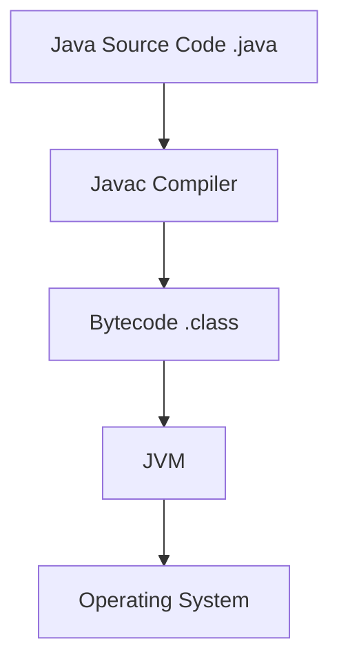
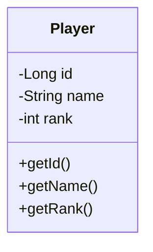
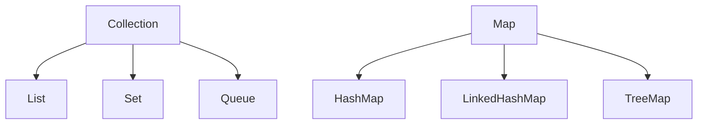
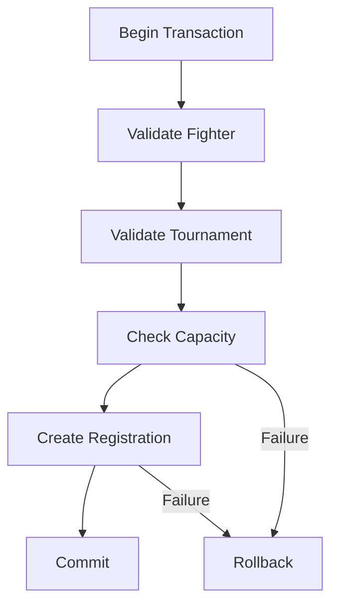
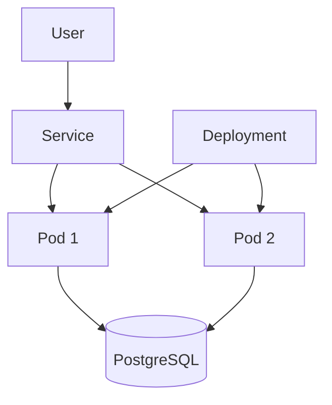
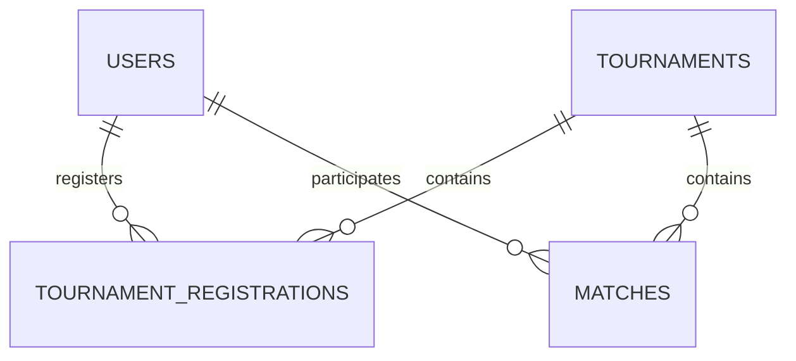

# Java Backend & DevOps Mastery

### From Java Fundamentals to JDBC, PostgreSQL, Docker & Kubernetes

> A progressive Java backend and DevOps learning path for developers coming from PHP/Laravel or web development.

---

## 📚 Table of Contents

1. [About This Repository](#-about-this-repository)
2. [Learning Roadmap](#-learning-roadmap)
3. [PHP/Laravel → Java](#-phplaravel--java)
4. [What Is Java?](#1--what-is-java)
5. [Installation & First Program](#2--installation--first-java-program)
6. [Variables & Data Types](#3--variables--data-types)
7. [Operators](#4--operators)
8. [Conditions](#5--conditions)
9. [Loops](#6--loops)
10. [Methods](#7--methods)
11. [Strings](#8--strings)
12. [Arrays](#9--arrays)
13. [Object-Oriented Programming](#10--object-oriented-programming)
14. [Enums](#11--enums)
15. [Packages & Project Structure](#12--packages--project-structure)
16. [Exceptions](#13--exceptions)
17. [Collections](#14--collections)
18. [List](#15--list)
19. [Set](#16--set)
20. [Map](#17--map)
21. [Generics](#18--generics)
22. [Date & Time](#19--date--time)
23. [Lambda Expressions](#20--lambda-expressions)
24. [Stream API](#21--stream-api)
25. [File Handling](#22--file-handling)
26. [Maven](#23--maven)
27. [Testing](#24--testing)
28. [Hashing & Salting](#25--hashing--salting)
29. [PostgreSQL](#26--postgresql)
30. [JDBC](#27--jdbc)
31. [Database Connection Management](#28--database-connection-management)
32. [Repository Pattern](#29--repository-pattern)
33. [Service Layer](#30--service-layer)
34. [Transactions](#31--transactions)
35. [Application Architecture](#32--application-architecture)
36. [Docker](#33--docker)
37. [Dockerfile](#34--dockerfile)
38. [Docker Compose](#35--docker-compose)
39. [Environment Variables & Secrets](#36--environment-variables--secrets)
40. [Kubernetes](#37--kubernetes)
41. [Kubernetes Exercises](#38--kubernetes-exercises)
42. [Final Project](#39--final-project)
43. [Final Project User Stories](#40--final-project-user-stories)
44. [Final Database Design](#41--final-database-design)
45. [Final Project Architecture](#42--final-project-architecture)
46. [Development Phases](#43--development-phases)
47. [Learning Checkpoints](#44--learning-checkpoints)
48. [Final Roadmap](#45--final-roadmap)
49. [Final Goal](#-final-goal)

---

# 🎯 About This Repository

This repository is a **complete Java backend and DevOps learning curriculum**.

It is designed for a developer who already understands some web-development concepts, especially PHP/Laravel, but wants to become comfortable with Java from the fundamentals all the way to:

* Object-Oriented Programming
* Collections
* Generics
* Streams
* Maven
* Testing
* PostgreSQL
* JDBC
* Repository and Service architecture
* Authentication
* Docker
* Docker Compose
* Kubernetes
* Minikube

The goal is not simply to memorize Java syntax.

The goal is to understand:

```text
What is this?
       ↓
Why does it exist?
       ↓
How does it work?
       ↓
When should I use it?
       ↓
How do I practice it?
       ↓
Where will I use it in a real project?
```

---

# 🎯 Who Is This For?

This repository is particularly useful if you:

* already know some programming;
* have experience with PHP/Laravel or another web stack;
* want to learn Java properly instead of jumping directly into Spring Boot;
* want to understand what frameworks are doing underneath;
* want to learn JDBC before JPA/Hibernate;
* want to understand relational databases;
* want to learn Docker and Kubernetes;
* want a complete project to apply everything.

You **do not need previous Java experience**.

---

# 🛠️ Prerequisites

You should ideally understand basic programming concepts such as:

* variables;
* conditions;
* loops;
* functions/methods;
* basic databases;
* basic Git.

Previous PHP/Laravel knowledge is helpful but **not required**.

---

# 💻 Required Software

Recommended environment:

| Tool                          | Recommendation                    |
| ----------------------------- | --------------------------------- |
| Java                          | Java 17+                          |
| JDK                           | OpenJDK / Oracle JDK              |
| IDE                           | IntelliJ IDEA / VS Code / Eclipse |
| Build tool                    | Maven                             |
| Database                      | PostgreSQL                        |
| DB GUI                        | pgAdmin                           |
| Containers                    | Docker                            |
| Multi-container orchestration | Docker Compose                    |
| Kubernetes                    | Kubernetes + Minikube             |
| Version control               | Git                               |
| Repository hosting            | GitHub                            |

Verify Java:

```bash
java --version
```

Verify the compiler:

```bash
javac --version
```

Verify Maven:

```bash
mvn --version
```

---

# 🗺️ Learning Roadmap

```text
LEVEL 01
Java Fundamentals
       ↓
LEVEL 02
Object-Oriented Programming
       ↓
LEVEL 03
Collections & Streams
       ↓
LEVEL 04
Maven & Testing
       ↓
LEVEL 05
PostgreSQL & SQL
       ↓
LEVEL 06
JDBC & Architecture
       ↓
LEVEL 07
Security
       ↓
LEVEL 08
Docker
       ↓
LEVEL 09
Docker Compose
       ↓
LEVEL 10
Kubernetes
       ↓
🏆 FINAL PROJECT
Dojo Tournament Manager
```

---

# 🔄 PHP/Laravel → Java

Coming from Laravel, many concepts will look familiar.

The important difference is that Java exposes much more of the underlying application structure.

| Concept               | PHP/Laravel     | Java                   |
| --------------------- | --------------- | ---------------------- |
| Language              | PHP             | Java                   |
| Runtime               | PHP Runtime     | JVM                    |
| Package manager       | Composer        | Maven                  |
| Dependency file       | `composer.json` | `pom.xml`              |
| ORM                   | Eloquent        | JPA/Hibernate          |
| Low-level DB API      | PDO             | JDBC                   |
| Exceptions            | PHP exceptions  | Java exceptions        |
| Collections           | Arrays          | `List` / `Set` / `Map` |
| Framework             | Laravel         | Spring Boot            |
| Build/dependency tool | Composer        | Maven                  |
| Container             | Docker          | Docker                 |

## Important distinction

Do not confuse these technologies:

```text
JDBC
  ↓
Low-level database API

JPA
  ↓
Java persistence specification

Hibernate
  ↓
JPA implementation / ORM

Spring Data JPA
  ↓
Higher-level repository abstraction
```

A useful analogy is:

```text
PHP PDO
    ≈
Java JDBC

Laravel Eloquent
    ≈
JPA/Hibernate
```

JDBC does **not** automatically behave like an ORM.

---

# 1 — What Is Java?

## What is Java?

Java is:

* a programming language;
* a platform based around the JVM;
* strongly typed;
* object-oriented;
* compiled to bytecode;
* widely used for backend systems, enterprise applications, Android history, distributed systems and many other environments.

A Java application normally follows this process:

```text
Java Source Code
       |
       | javac
       ↓
Bytecode
.class
       |
       ↓
JVM
       |
       ↓
Operating System
```

## JVM

The **Java Virtual Machine** executes Java bytecode.

The JVM provides the runtime environment that allows Java bytecode to run on different operating systems.

## JDK

The **Java Development Kit** contains the tools needed to develop Java applications.

It includes tools such as:

```text
javac
java
javadoc
jar
```

Conceptually:

```text
JDK
├── JVM
└── Development tools
```

## JRE

The JRE historically represented the runtime components required to run Java applications.

For modern Java development, install a **JDK** rather than thinking of the JRE as a separate installation.

## `.java`

Java source code:

```text
Main.java
```

## `.class`

Compiled bytecode:

```text
Main.class
```

## Compilation

```bash
javac Main.java
```

The compiler transforms source code into bytecode.

## Execution

```bash
java Main
```

The JVM loads and executes the compiled class.

---

## JVM Visual Model



---

## Example

```java
public class Main {

    public static void main(String[] args) {
        System.out.println("Hello Java!");
    }
}
```

### Breaking it down

### `public`

The method/class is accessible from outside its package/class context.

### `class`

Defines a Java class.

### `Main`

The class name.

### `public static void main`

The conventional entry point used to launch a Java application.

### `static`

The method belongs to the class rather than requiring an instance.

### `void`

The method does not return a value.

### `main`

The method name recognized as the application's entry point.

### `String[] args`

An array of command-line arguments.

### `System`

A standard Java class providing access to system functionality.

### `out`

The standard output stream.

### `println`

Prints text followed by a new line.

---

## 🧪 Exercises

### Easy

```java
// TODO 1.1:
// Print your name.

// TODO 1.2:
// Print your age.

// TODO 1.3:
// Print three separate lines.
```

### Medium

Create a profile program displaying:

```text
Name:
Age:
City:
Programming Language:
```

### Hard

Create a console introduction program using variables and formatted output.

### Verification

* [ ] Java is installed.
* [ ] `javac` works.
* [ ] You can compile a `.java` file.
* [ ] You can execute a `.class` file.
* [ ] You understand JDK/JVM/bytecode.

---

### 📚 Resources

* [Oracle Java Documentation](https://docs.oracle.com/en/java/)
* [OpenJDK](https://openjdk.org/)
* [Java Language Specification](https://docs.oracle.com/javase/specs/)

## ⚠️ Common Mistakes

* Confusing Java with the JVM.
* Thinking `.java` files execute directly.
* Installing only a runtime when you need development tools.
* Assuming Java and JavaScript are the same technology.

---

# 2 — Installation & First Java Program

## Check Java

```bash
java --version
javac --version
```

## JAVA_HOME

`JAVA_HOME` should point to your JDK installation.

The `PATH` allows commands such as:

```bash
java
javac
```

to be found by the terminal.

---

## Manual Project

```text
java-learning/
└── src/
    └── Main.java
```

Compile:

```bash
javac src/Main.java
```

Run from the appropriate classpath:

```bash
java -cp src Main
```

---

## 🧪 Exercises

### Easy

```java
// TODO 2.1:
// Print your full name.

// TODO 2.2:
// Print your age.

// TODO 2.3:
// Print your favorite technology.
```

### Medium

Build:

```text
========== PROFILE ==========

Name: ...
Age: ...
City: ...
Role: ...

==============================
```

### Hard

Create an interactive console introduction program using variables and formatted output.

---

### 📚 Resources

* [Oracle Java Tutorials](https://docs.oracle.com/javase/tutorial/)
* [OpenJDK](https://openjdk.org/)

## ⚠️ Common Mistakes

* Confusing `javac` with `java`.
* Using the `.java` extension when executing a class.
* Forgetting the correct classpath.
* Naming a public class differently from its file.

---

# 3 — Variables & Data Types

Java is statically typed.

That means a variable has a declared type.

```java
int age = 21;
```

The variable `age` is an `int`.

---

## Primitive Types

| Type      |                 Typical size | Example   | Typical use                  |
| --------- | ---------------------------: | --------- | ---------------------------- |
| `byte`    |                       8 bits | `10`      | Very small integers          |
| `short`   |                      16 bits | `1000`    | Small integers               |
| `int`     |                      32 bits | `100000`  | General integers             |
| `long`    |                      64 bits | `100000L` | Large integers               |
| `float`   |                      32 bits | `10.5f`   | Floating-point values        |
| `double`  |                      64 bits | `10.5`    | General decimal calculations |
| `char`    |                      16 bits | `'A'`     | One UTF-16 code unit         |
| `boolean` | JVM-dependent representation | `true`    | Logical values               |

For normal application development:

```text
int
long
double
boolean
char
```

are encountered frequently.

---

## Examples

```java
int age = 21;

long population = 1000000L;

double price = 149.99;

float temperature = 21.5f;

boolean active = true;

char grade = 'A';
```

---

## String

`String` is **not a primitive type**.

It is a reference type.

```java
String name = "Oussama";
```

Conceptually:

```text
Primitive
    ↓
Stores a primitive value

Reference
    ↓
Refers to an object
```

---

## 🧪 Exercises

### Easy

```java
// TODO 3.1:
// Create variables for:
// - name
// - age
// - height
// - active status
// - grade
```

### Medium

Create a product:

```text
name
price
quantity
available
```

Calculate the total price.

### Hard

Build a small invoice calculator using multiple numeric types.

---

### 📚 Resources

* [Java Language Specification — Types](https://docs.oracle.com/javase/specs/jls/se17/html/jls-4.html)

## ⚠️ Common Mistakes

* Using `int` when a `long` is required.
* Forgetting `L` for large integer literals.
* Forgetting `f` for `float`.
* Assuming `String` is primitive.
* Ignoring numeric conversion rules.

---

# 4 — Operators

Java provides several categories of operators.

## Arithmetic

```java
+
-
*
/
%
```

## Comparison

```java
==
!=
>
<
>=
<=
```

## Logical

```java
&&
||
!
```

## Assignment

```java
=
+=
-=
*=
/=
%=
```

## Increment / Decrement

```java
++
--
```

## Ternary

```java
condition ? valueIfTrue : valueIfFalse
```

Example:

```java
int age = 20;

String result = age >= 18
        ? "Adult"
        : "Minor";
```

---

## 🧪 Exercises

### Easy

Build a calculator for:

```text
addition
subtraction
multiplication
division
remainder
```

### Medium

Create a discount calculator.

Input:

```text
price
discount percentage
```

Output:

```text
original price
discount
final price
```

### Hard

Create a billing engine that calculates:

* subtotal;
* discount;
* tax;
* final total.

### Verification

* [ ] Arithmetic works.
* [ ] Comparison works.
* [ ] Logical operators are understood.
* [ ] Division by zero is considered.
* [ ] Operator precedence is understood.

---

### 📚 Resources

* [Java Operators — Oracle](https://docs.oracle.com/javase/tutorial/java/nutsandbolts/operators.html)

## ⚠️ Common Mistakes

* Confusing `=` and `==`.
* Forgetting integer division behavior.
* Writing unnecessarily complex boolean expressions.

---

# 5 — Conditions

Conditions allow applications to make decisions.

## `if`

```java
if (age >= 18) {
    System.out.println("Adult");
}
```

## `if / else`

```java
if (age >= 18) {
    System.out.println("Adult");
} else {
    System.out.println("Minor");
}
```

## `else if`

```java
if (score >= 90) {
    System.out.println("A");
} else if (score >= 80) {
    System.out.println("B");
} else {
    System.out.println("C");
}
```

## `switch`

Useful when comparing a value against multiple cases.

```java
switch (role) {
    case "ADMIN":
        System.out.println("Administrator");
        break;

    case "USER":
        System.out.println("User");
        break;

    default:
        System.out.println("Unknown role");
}
```

## Switch Expressions

Modern Java also supports switch expressions:

```java
String label = switch (role) {
    case "ADMIN" -> "Administrator";
    case "USER" -> "User";
    default -> "Unknown";
};
```

---

## 🧪 Exercises

### Easy

* Positive/negative checker.
* Even/odd checker.

### Medium

Create a grade calculator.

### Hard

Build a console authentication decision system that checks:

```text
username
password
role
account status
```

---

### 📚 Resources

* [Oracle — Control Flow](https://docs.oracle.com/javase/tutorial/java/nutsandbolts/flow.html)

## ⚠️ Common Mistakes

* Forgetting braces.
* Creating deeply nested conditions.
* Using strings where an enum would be more appropriate.

---

# 6 — Loops

Loops repeat instructions.

## `for`

```java
for (int i = 0; i < 10; i++) {
    System.out.println(i);
}
```

## `while`

```java
while (condition) {
    // repeat
}
```

## `do while`

```java
do {
    // execute at least once
} while (condition);
```

## Enhanced `for`

```java
for (Player player : players) {
    System.out.println(player);
}
```

---

## Loop Mental Model

```text
        ┌─────────────┐
        │   Start     │
        └──────┬──────┘
               ↓
        ┌─────────────┐
        │  Condition  │
        └──────┬──────┘
           Yes │
               ↓
        ┌─────────────┐
        │    Body     │
        └──────┬──────┘
               ↓
        ┌─────────────┐
        │   Update    │
        └──────┬──────┘
               │
               └──────→ Condition

No → Exit
```

---

## `break`

Stops the loop.

## `continue`

Skips the current iteration.

---

## 🧪 Exercises

### Easy

* Print `1–100`.
* Calculate a sum.
* Create a multiplication table.

### Medium

* Number guessing game.
* Prime number checker.

### Hard

Create a console menu that remains active until:

```text
0. Exit
```

is selected.

---

### 📚 Resources

* [Oracle — The for Statement](https://docs.oracle.com/javase/tutorial/java/nutsandbolts/for.html)

## ⚠️ Common Mistakes

* Infinite loops.
* Incorrect loop conditions.
* Off-by-one errors.
* Modifying a collection incorrectly while iterating.

---

# 7 — Methods

Methods organize behavior.

```java
public static int add(int a, int b) {
    return a + b;
}
```

Breakdown:

```text
public
static
int
add
(int a, int b)
return
```

---

## Parameters

```java
public static void greet(String name) {
    System.out.println("Hello " + name);
}
```

## Return Values

```java
public static int square(int number) {
    return number * number;
}
```

## `void`

A method returning no value:

```java
public static void printHello() {
    System.out.println("Hello");
}
```

## Overloading

Multiple methods can have the same name if their parameter lists differ.

```java
public static int add(int a, int b) {
    return a + b;
}

public static double add(double a, double b) {
    return a + b;
}
```

---

## 🧪 Exercises

### Easy

Create methods for:

```text
add
subtract
multiply
isEven
```

### Medium

Create a calculator using methods.

### Hard

Create a reusable billing service containing separate methods for:

```text
calculateSubtotal()
calculateDiscount()
calculateTax()
calculateTotal()
```

---

### 📚 Resources

* [Oracle — Defining Methods](https://docs.oracle.com/javase/tutorial/java/javaOO/methods.html)

## ⚠️ Common Mistakes

* Making everything `static`.
* Creating huge methods.
* Giving methods multiple unrelated responsibilities.
* Using unclear method names.

---

# 8 — Strings

`String` represents text.

```java
String name = "Oussama";
```

Strings are immutable.

That means operations on a String produce another String rather than modifying the existing String object.

---

## Common Methods

```java
length()
contains()
equals()
equalsIgnoreCase()
substring()
toUpperCase()
toLowerCase()
trim()
split()
replace()
```

Example:

```java
String name = "Oussama";

System.out.println(name.length());
System.out.println(name.toUpperCase());
```

---

## `==` vs `.equals()`

Do not normally compare String content with:

```java
name == "Oussama"
```

Use:

```java
name.equals("Oussama")
```

or, when null safety matters:

```java
"Oussama".equals(name)
```

`==` compares references for objects, while `.equals()` is used for logical equality according to the class implementation.

---

## StringBuilder

For repeated string construction:

```java
StringBuilder builder = new StringBuilder();

builder.append("Hello");
builder.append(" ");
builder.append("Java");

String result = builder.toString();
```

---

## 🧪 Exercises

### Easy

Create a program that:

* counts characters;
* converts text to uppercase;
* checks whether a word exists.

### Medium

Create a username validator.

### Hard

Create a text-processing utility that:

* normalizes text;
* counts words;
* removes unnecessary spaces;
* generates a formatted result.

---

### 📚 Resources

* [Oracle — String Class](https://docs.oracle.com/en/java/javase/17/docs/api/java.base/java/lang/String.html)

## ⚠️ Common Mistakes

* Using `==` for String content.
* Forgetting String immutability.
* Creating excessive temporary Strings in loops.

---

# 9 — Arrays

An array stores a fixed number of elements of the same type.

```java
int[] numbers = new int[5];
```

Or:

```java
int[] numbers = {10, 20, 30, 40};
```

Access:

```java
numbers[0]
```

Length:

```java
numbers.length
```

---

## Iteration

```java
for (int number : numbers) {
    System.out.println(number);
}
```

---

## Multidimensional Arrays

```java
int[][] matrix = {
    {1, 2},
    {3, 4}
};
```

---

## 🧪 Exercises

### Easy

Find the maximum value.

### Medium

Calculate the average.

### Hard

Build a statistics program calculating:

```text
minimum
maximum
average
sum
count
```

---

### 📚 Resources

* [Oracle — Arrays](https://docs.oracle.com/javase/tutorial/java/nutsandbolts/arrays.html)

## ⚠️ Common Mistakes

* Accessing invalid indexes.
* Confusing `.length` with `.length()`.
* Forgetting arrays have fixed size.

---

# 10 — Object-Oriented Programming

Object-Oriented Programming is one of the most important parts of Java.

---

## What Is a Class?

A class is a blueprint.

```text
Class
  ↓
Blueprint

Object
  ↓
Actual instance
```

Example:

```text
Class: Player

Objects:
Player #1 → Oussama
Player #2 → Ali
Player #3 → Yassine
```

---

## Class

```java
public class Player {

    private Long id;
    private String name;
    private int rank;

}
```

## Object

```java
Player player = new Player();
```

---

## Constructor

```java
public Player(Long id, String name, int rank) {
    this.id = id;
    this.name = name;
    this.rank = rank;
}
```

## `this`

`this` refers to the current object.

```java
this.name = name;
```

means:

```text
object's name = method/constructor parameter
```

---

# Encapsulation

Encapsulation means controlling access to an object's internal state.

Prefer:

```java
private String username;
```

instead of:

```java
public String username;
```

Then expose controlled methods:

```java
public String getUsername() {
    return username;
}

public void setUsername(String username) {
    this.username = username;
}
```

---

# Access Modifiers

| Modifier        | Visibility           |
| --------------- | -------------------- |
| `public`        | Everywhere           |
| `protected`     | Package + subclasses |
| package-private | Same package         |
| `private`       | Same class           |

---

# Inheritance

Inheritance allows a class to derive from another class.

```java
class Animal {
    void eat() {
        System.out.println("Eating");
    }
}

class Dog extends Animal {
}
```

---

# Polymorphism

A parent reference can refer to a child object.

```java
Animal animal = new Dog();
```

The actual object determines overridden behavior.

---

# Abstraction

Abstraction focuses on **what an object does** rather than exposing every implementation detail.

---

# Interfaces

```java
public interface PaymentService {
    void pay();
}
```

Implementation:

```java
public class CardPaymentService implements PaymentService {

    @Override
    public void pay() {
        System.out.println("Paying by card");
    }
}
```

---

# Abstract Classes

```java
public abstract class Animal {

    public abstract void makeSound();

}
```

---

## When Should I Use What?

```text
Interface
    ↓
Define a contract

Abstract class
    ↓
Share common state/behavior

Inheritance
    ↓
Represent a meaningful "is-a" relationship

Composition
    ↓
Combine objects without forcing inheritance
```

---

## UML



---

## 🧪 Exercises

### Easy

Create:

```text
Player
```

with:

```text
id
name
rank
```

### Medium

Create:

```text
Player
Tournament
Match
```

with constructors and methods.

### Hard

Create a complete small tournament domain using:

* encapsulation;
* interfaces;
* inheritance where appropriate;
* polymorphism;
* composition.

---

### 📚 Resources

* [Oracle — Object-Oriented Programming Concepts](https://docs.oracle.com/javase/tutorial/java/concepts/)
* [Java Language Specification](https://docs.oracle.com/javase/specs/)

## ⚠️ Common Mistakes

* Making every field public.
* Using inheritance everywhere.
* Creating getters/setters without thinking about domain behavior.
* Making everything static.
* Confusing interfaces with classes.

---

# 11 — Enums

Enums represent a fixed set of valid values.

```java
public enum UserRole {
    ADMIN,
    CLIENT
}
```

Instead of:

```java
String role = "ADMIN";
```

use:

```java
UserRole role = UserRole.ADMIN;
```

This gives the compiler more information and prevents many invalid values.

---

## Examples

```java
public enum RoomStatus {
    AVAILABLE,
    OCCUPIED,
    MAINTENANCE
}
```

```java
public enum PaymentStatus {
    PENDING,
    COMPLETED,
    REFUNDED,
    FAILED
}
```

---

## 🧪 Exercises

### Easy

Create:

```text
UserRole
```

with:

```text
ADMIN
CLIENT
```

### Medium

Create:

```text
RoomStatus
```

### Hard

Create an application state system using multiple enums and `switch`.

---

### 📚 Resources

* [Oracle — Enum Types](https://docs.oracle.com/javase/tutorial/java/javaOO/enum.html)

## ⚠️ Common Mistakes

* Replacing enums with arbitrary Strings.
* Comparing enum names incorrectly.
* Adding too much unrelated behavior to an enum.

---

# 12 — Packages & Project Structure

Packages act as Java namespaces.

Example:

```text
src/
└── main/
    └── java/
        └── com/
            └── dojo/
                ├── model/
                ├── repository/
                ├── service/
                └── ui/
```

The package declaration:

```java
package com.dojo.model;
```

An import:

```java
import com.dojo.model.User;
```

## Incorrect Import

This is **not valid Java syntax**:

```java
import ./com/main/java/model/User.java;
```

Java imports a class using its package-qualified name, not a filesystem path.

Correct:

```java
import com.dojo.model.User;
```

---

## 🧪 Exercise

Create:

```text
com.dojo.model
com.dojo.repository
com.dojo.service
com.dojo.ui
```

Then create a `Player` class in `model`.

---

### 📚 Resources

* [Oracle — Creating and Using Packages](https://docs.oracle.com/javase/tutorial/java/package/)

## ⚠️ Common Mistakes

* Using filesystem paths in imports.
* Incorrect package declarations.
* Mixing unrelated responsibilities in one package.

---

# 13 — Exceptions

Exceptions represent abnormal situations that interrupt normal execution.

```java
try {
    // risky operation
} catch (Exception e) {
    // handle error
}
```

---

## Checked vs Unchecked

### Checked

The compiler requires the programmer to deal with them in appropriate situations.

Examples include:

```text
IOException
SQLException
```

### Unchecked

Usually subclasses of `RuntimeException`.

Examples:

```text
NullPointerException
IllegalArgumentException
IllegalStateException
```

---

# `throw`

Used to explicitly throw an exception.

```java
throw new IllegalArgumentException("Invalid age");
```

# `throws`

Declares that a method may propagate an exception.

```java
public void readFile() throws IOException {
}
```

---

# Custom Business Exceptions

```java
public class UserNotFoundException extends RuntimeException {

    public UserNotFoundException(String message) {
        super(message);
    }
}
```

This is useful when the application needs to communicate domain-specific failures.

---

## 🧪 Exercises

### Easy

Handle invalid user input.

### Medium

Create:

```text
UserNotFoundException
InvalidCredentialsException
```

### Hard

Create a complete business-exception hierarchy for the tournament application.

---

### 📚 Resources

* [Oracle — Exceptions](https://docs.oracle.com/javase/tutorial/essential/exceptions/)

## ⚠️ Common Mistakes

* Catching `Exception` everywhere.
* Ignoring exceptions.
* Using exceptions for normal control flow.
* Creating meaningless custom exceptions.

---

# 14 — Collections

Java Collections provide reusable data structures.

Conceptually:

```text
Collection
├── List
├── Set
└── Queue

Map
```

`Map` is separate from the `Collection` hierarchy.

---

## Which One?

```text
Need order + duplicates?
        ↓
       List

Need uniqueness?
        ↓
       Set

Need key → value?
        ↓
       Map
```

---

## Collections Visual



---

### 📚 Resources

* [Oracle — Collections Framework](https://docs.oracle.com/javase/8/docs/technotes/guides/collections/overview.html)

## ⚠️ Common Mistakes

* Using `List` when uniqueness is required.
* Assuming all collections have the same performance.
* Modifying collections incorrectly during iteration.

---

# 15 — List

```java
List<Player> players = new ArrayList<>();
```

A List:

* preserves order;
* allows duplicates;
* supports indexes.

---

## Common Operations

```java
players.add(player);

players.get(0);

players.set(0, player);

players.remove(0);

players.contains(player);

players.size();

players.isEmpty();

players.clear();
```

---

## ArrayList vs LinkedList

Conceptually:

```text
ArrayList
    ↓
Fast indexed access
    ↓
Backed by a resizable array

LinkedList
    ↓
Linked nodes
    ↓
Different insertion/removal characteristics
```

For most ordinary application lists, `ArrayList` is a sensible default.

---

## 🧪 Easy Exercise

```java
// TODO 15.1:
// Create a List<Player>.

// TODO 15.2:
// Add 5 players.

// TODO 15.3:
// Print every player.

// TODO 15.4:
// Print the player at index 2.

// TODO 15.5:
// Remove one player.

// TODO 15.6:
// Print the final list.
```

### Medium

Build a tournament registration list.

### Hard

Build an in-memory tournament bracket using Lists.

---

### 📚 Resources

* [Oracle — List](https://docs.oracle.com/en/java/javase/17/docs/api/java.base/java/util/List.html)
* [Oracle — ArrayList](https://docs.oracle.com/en/java/javase/17/docs/api/java.base/java/util/ArrayList.html)

## ⚠️ Common Mistakes

* Accessing an invalid index.
* Using a List when duplicates are forbidden.
* Assuming `LinkedList` is automatically faster.

---

# 16 — Set

A Set stores unique elements.

```java
Set<String> usernames = new HashSet<>();
```

If:

```java
usernames.add("oussama");
usernames.add("oussama");
```

the set still contains only one occurrence.

Useful for:

```text
unique usernames
unique participants
unique tags
```

---

## 🧪 Exercises

### Easy

Create a set of usernames.

### Medium

Detect duplicate tournament participants.

### Hard

Create a participant-management system that guarantees uniqueness.

---

### 📚 Resources

* [Oracle — Set](https://docs.oracle.com/en/java/javase/17/docs/api/java.base/java/util/Set.html)

## ⚠️ Common Mistakes

* Assuming `HashSet` preserves insertion order.
* Using a Set when index-based access is required.

---

# 17 — Map

A Map stores:

```text
Key → Value
```

Example:

```java
Map<Long, Player> players = new HashMap<>();
```

Conceptually:

```text
101 → Player("Oussama")
102 → Player("Ali")
103 → Player("Yassine")
```

---

## Common Operations

```java
put()
get()
getOrDefault()
containsKey()
containsValue()
remove()
replace()
putIfAbsent()
keySet()
values()
entrySet()
```

Example:

```java
players.put(101L, player);
```

Retrieve:

```java
Player player = players.get(101L);
```

---

## Iteration

```java
for (Map.Entry<Long, Player> entry : players.entrySet()) {
    System.out.println(entry.getKey());
    System.out.println(entry.getValue());
}
```

Values only:

```java
for (Player player : players.values()) {
    System.out.println(player);
}
```

Keys:

```java
for (Long id : players.keySet()) {
    System.out.println(id);
}
```

---

## Real Backend Examples

```text
User ID      → User
Room number  → Room
Product ID   → Product
Cache key    → Object
Config key   → Configuration value
```

---

## HashMap

General-purpose hash-based Map.

## LinkedHashMap

Maintains insertion order.

## TreeMap

Maintains keys in sorted order.

---

## Big-O Intuition

You do not need advanced mathematics yet.

Think:

```text
O(1)
    → approximately constant lookup

O(n)
    → work grows with number of elements

O(log n)
    → grows slowly as data grows
```

A hash-based Map often provides approximately constant-time average lookup, but exact performance depends on implementation and workload.

---

## 🧪 Easy

Student ID → Student.

### Medium

Tournament ID → Tournament.

### Hard

Build:

```java
Map<Long, Player>
```

as the internal storage of an in-memory repository.

---

### 📚 Resources

* [Oracle — Map](https://docs.oracle.com/en/java/javase/17/docs/api/java.base/java/util/Map.html)
* [Oracle — HashMap](https://docs.oracle.com/en/java/javase/17/docs/api/java.base/java/util/HashMap.html)

## ⚠️ Common Mistakes

* Assuming `HashMap` is ordered.
* Using the wrong key type.
* Forgetting to check whether a key exists.
* Confusing `containsKey()` and `containsValue()`.

---

# 18 — Generics

Generics allow classes and methods to work with strongly typed data.

```java
List<Player>
Map<Long, Player>
Set<String>
```

Without generics, more casting would be required and type safety would be reduced.

---

## Generic Class

Conceptually:

```java
public class Box<T> {

    private T value;

    public Box(T value) {
        this.value = value;
    }

    public T getValue() {
        return value;
    }
}
```

Usage:

```java
Box<String> box = new Box<>("Hello");
```

---

## Generic Method

```java
public static <T> void printValue(T value) {
    System.out.println(value);
}
```

---

## 🧪 Exercises

### Easy

Use generic collections.

### Medium

Create:

```java
Box<T>
```

### Hard

Create a reusable generic in-memory repository abstraction.

---

### 📚 Resources

* [Oracle — Generics](https://docs.oracle.com/javase/tutorial/java/generics/)

## ⚠️ Common Mistakes

* Using raw types such as `List` instead of `List<Player>`.
* Adding unnecessary generic complexity.
* Confusing generic types with inheritance.

---

# 19 — Date & Time

Modern Java uses the `java.time` API.

Important types:

```text
LocalDate
LocalTime
LocalDateTime
Instant
Duration
Period
```

---

## LocalDate

Date without time:

```java
LocalDate date = LocalDate.now();
```

Useful for:

```text
birthday
tournament date
reservation date
```

## LocalTime

```java
LocalTime time = LocalTime.now();
```

## LocalDateTime

```java
LocalDateTime createdAt = LocalDateTime.now();
```

## Instant

Represents a point on the global timeline.

Useful for timestamps and system events.

## Duration

Measures time-based quantities:

```text
hours
minutes
seconds
```

## Period

Measures calendar-based quantities:

```text
years
months
days
```

---

## 🧪 Exercises

### Easy

Create a tournament date.

### Medium

Calculate the duration between two timestamps.

### Hard

Build reservation scheduling logic.

---

### 📚 Resources

* [Oracle — Date-Time API](https://docs.oracle.com/javase/tutorial/datetime/)

## ⚠️ Common Mistakes

* Using legacy date APIs unnecessarily in new code.
* Confusing `Duration` and `Period`.
* Ignoring time zones when the application requires them.

---

# 20 — Lambda Expressions

A lambda provides a concise way to represent behavior.

Example:

```java
player -> player.getName()
```

Instead of writing an entire anonymous implementation.

---

## Example

```java
players.forEach(
    player -> System.out.println(player.getName())
);
```

Another example:

```java
players.removeIf(
    player -> player.getRank() < 100
);
```

Lambdas are heavily used with:

* Collections;
* Streams;
* functional interfaces.

---

## 🧪 Exercises

### Easy

Print every player using `forEach`.

### Medium

Remove players matching a condition.

### Hard

Create several reusable operations using functional interfaces.

---

### 📚 Resources

* [Oracle — Lambda Expressions](https://docs.oracle.com/javase/tutorial/java/javaOO/lambdaexpressions.html)

## ⚠️ Common Mistakes

* Writing unreadable one-line lambdas.
* Using lambdas where a named method would be clearer.
* Forgetting that lambdas need a compatible functional-interface target.

---

# 21 — Stream API

Streams process collections through a pipeline.

```text
Collection
    ↓
stream()
    ↓
filter()
    ↓
map()
    ↓
sorted()
    ↓
collect()
```

Example:

```java
List<String> names = players.stream()
        .filter(player -> player.getRank() > 100)
        .map(Player::getName)
        .sorted()
        .toList();
```

---

## Important Operations

### `filter`

Select elements.

```java
players.stream()
    .filter(player -> player.getRank() > 100)
```

### `map`

Transform elements.

```java
players.stream()
    .map(Player::getName)
```

### `sorted`

Sort elements.

### `distinct`

Remove duplicates.

### `limit`

Keep a limited number.

### `count`

Count elements.

### `findFirst`

Retrieve the first matching element.

### `anyMatch`

Checks whether at least one element matches.

### `allMatch`

Checks whether all elements match.

### `collect`

Collect results.

---

## When Should I Use Streams?

Streams are useful when they make a transformation or filtering pipeline clearer.

A normal loop can be better when:

* logic is highly stateful;
* there are many branches;
* debugging step-by-step is important;
* a stream would become difficult to read.

---

## 🧪 Exercises

### Easy

Filter players above a rank.

### Medium

Transform players into names.

### Hard

Generate tournament statistics using streams.

---

### 📚 Resources

* [Oracle — Stream API](https://docs.oracle.com/en/java/javase/17/docs/api/java.base/java/util/stream/package-summary.html)

## ⚠️ Common Mistakes

* Creating extremely complicated streams.
* Using streams just to look advanced.
* Forgetting that streams are not collections.
* Assuming every stream pipeline is automatically faster.

---

# 22 — File Handling

Modern Java file handling commonly uses:

```java
Path
Files
```

Example:

```java
Path path = Path.of("data.txt");
```

Read:

```java
String content = Files.readString(path);
```

Write:

```java
Files.writeString(path, "Hello Java");
```

---

## 🧪 Exercises

### Easy

Write text to a file.

### Medium

Read a configuration file.

### Hard

Create a simple log/report generator.

---

### 📚 Resources

* [Oracle — File I/O](https://docs.oracle.com/javase/tutorial/essential/io/)

## ⚠️ Common Mistakes

* Ignoring `IOException`.
* Hardcoding OS-specific paths.
* Forgetting resource management when using lower-level I/O APIs.

---

# 23 — Maven

Maven is a build and dependency-management tool.

It can:

* manage dependencies;
* compile code;
* run tests;
* package applications;
* execute plugins;
* standardize project structure.

---

# `pom.xml`

Maven projects are configured using:

```text
pom.xml
```

Example structure:

```xml
<project>
    <modelVersion>4.0.0</modelVersion>

    <groupId>com.dojo</groupId>
    <artifactId>dojo-manager</artifactId>
    <version>1.0-SNAPSHOT</version>
</project>
```

---

# Standard Structure

```text
project/
├── pom.xml
├── src/
│   ├── main/
│   │   ├── java/
│   │   └── resources/
│   └── test/
│       └── java/
└── target/
```

---

# Important Commands

Clean:

```bash
mvn clean
```

Compile:

```bash
mvn compile
```

Test:

```bash
mvn test
```

Package:

```bash
mvn package
```

Clean + package:

```bash
mvn clean package
```

---

## Maven Lifecycle

Conceptually:

```text
validate
   ↓
compile
   ↓
test
   ↓
package
   ↓
verify
   ↓
install
   ↓
deploy
```

---

## `target/`

Maven generates build artifacts in:

```text
target/
```

For example:

```text
target/classes
target/test-classes
target/*.jar
```

---

## 🧪 Exercises

### Easy

Create a Maven project.

### Medium

Add a dependency.

### Hard

Create a complete multi-package Maven project with tests.

---

### 📚 Resources

* [Apache Maven](https://maven.apache.org/)
* [Maven Introduction](https://maven.apache.org/guides/getting-started/maven-in-five-minutes.html)

## ⚠️ Common Mistakes

* Typing `achretype` instead of `archetype`.
* Editing generated files without understanding Maven structure.
* Committing `target/` unnecessarily.
* Adding dependencies without understanding their purpose.

---

# 24 — Testing

Testing verifies application behavior.

## Unit Test

Tests a small unit of behavior in isolation.

## Integration Test

Tests multiple components working together.

Example:

```text
Service
   ↓
Repository
   ↓
Database
```

---

# JUnit

Example:

```java
@Test
void shouldCalculateTotal() {
    // Arrange
    // Act
    // Assert
}
```

---

# Arrange / Act / Assert

```text
Arrange
   ↓
Prepare data

Act
   ↓
Execute behavior

Assert
   ↓
Verify result
```

---

## Test Naming

Prefer descriptive names:

```text
shouldRejectDuplicateRegistration()
shouldCalculateTournamentCapacity()
shouldFindPlayerById()
```

---

## Mockito

Mockito is a mocking framework commonly used to isolate dependencies in unit tests.

Conceptually:

```text
Service
  ↓
Mock Repository
```

instead of:

```text
Service
  ↓
Real Repository
  ↓
Database
```

---

## 🧪 Exercises

### Easy

Test arithmetic methods.

### Medium

Test a service with a fake dependency.

### Hard

Test a Service using Mockito-style mocks.

---

### 📚 Resources

* [JUnit](https://junit.org/)
* [Mockito](https://site.mockito.org/)

## ⚠️ Common Mistakes

* Testing implementation details instead of behavior.
* Writing tests that depend on each other.
* Making unit tests depend unnecessarily on a real database.

---

# 25 — Hashing & Salting

Security requires understanding three different concepts:

```text
Encryption ≠ Hashing ≠ Encoding
```

---

## Encoding

Encoding transforms data into another representation.

Example:

```text
Base64
```

Encoding is reversible.

---

## Encryption

Encryption is designed to be reversible when the correct key is available.

```text
Plaintext
   ↓
Encryption + Key
   ↓
Ciphertext
```

---

## Hashing

Hashing is designed as a one-way transformation.

```text
Input
  ↓
Hash function
  ↓
Hash
```

A password should not be stored as plaintext.

---

# Salt

A salt is a random value associated with a password before password hashing.

Conceptually:

```text
Password
   +
Unique Random Salt
   ↓
Password Hashing Function
   ↓
Stored Hash

Database:

password_hash
salt
```

A unique salt should be generated for each password.

---

# Important Security Rule

Do **not** treat plain SHA-256 as a production password-storage solution.

SHA-256 is useful here as a learning exercise for understanding hashing.

Production password storage should use dedicated password-hashing algorithms such as:

```text
Argon2id
bcrypt
scrypt
PBKDF2
```

These algorithms are designed for password hashing and can be configured to make guessing attacks more expensive.

---

## Learning Exercise

### Easy

Generate a random salt with `SecureRandom`.

### Medium

Implement educational SHA-256 hashing:

```text
password + salt
       ↓
SHA-256
       ↓
hash
```

### Hard

Implement registration and login using a dedicated password-hashing library.

---

### 📚 Resources

* [OWASP Password Storage Cheat Sheet](https://cheatsheetseries.owasp.org/cheatsheets/Password_Storage_Cheat_Sheet.html)
* [OWASP Cryptographic Storage Cheat Sheet](https://cheatsheetseries.owasp.org/cheatsheets/Cryptographic_Storage_Cheat_Sheet.html)

## ⚠️ Common Mistakes

* Storing plaintext passwords.
* Reusing one salt for every user.
* Confusing encoding with hashing.
* Confusing hashing with encryption.
* Using SHA-256 alone for production password storage.

---

# 26 — PostgreSQL

PostgreSQL is a relational database management system.

Before JDBC, understand SQL and relational databases.

---

## Core Concepts

```text
Database
    ↓
Tables
    ↓
Rows
    ↓
Columns
```

Important concepts:

* Primary key
* Foreign key
* Unique constraint
* `NOT NULL`
* `CHECK`
* Index

---

# SQL CRUD

Create:

```sql
CREATE TABLE players (
    id BIGSERIAL PRIMARY KEY,
    username VARCHAR(100) NOT NULL UNIQUE
);
```

Insert:

```sql
INSERT INTO players (username)
VALUES ('oussama');
```

Read:

```sql
SELECT *
FROM players;
```

Update:

```sql
UPDATE players
SET username = 'ali'
WHERE id = 1;
```

Delete:

```sql
DELETE FROM players
WHERE id = 1;
```

---

# Filtering

```sql
SELECT *
FROM players
WHERE username = 'oussama';
```

Sorting:

```sql
SELECT *
FROM players
ORDER BY username;
```

Grouping:

```sql
SELECT rank, COUNT(*)
FROM players
GROUP BY rank;
```

Joining:

```sql
SELECT p.username, t.name
FROM tournament_registrations tr
JOIN players p ON p.id = tr.player_id
JOIN tournaments t ON t.id = tr.tournament_id;
```

---

# Relationships

```text
1 : 1
One-to-one

1 : N
One-to-many

N : N
Many-to-many
```

Many-to-many relationships commonly use a junction table.

---

# Tools

## `psql`

PostgreSQL command-line client.

## pgAdmin

Graphical PostgreSQL management interface.

---

## 🧪 Exercises

### Easy

Create a database and table.

### Medium

Implement CRUD.

### Hard

Create a multi-table tournament schema.

---

### 📚 Resources

* [PostgreSQL Documentation](https://www.postgresql.org/docs/)
* [PostgreSQL Tutorial](https://www.postgresql.org/docs/current/tutorial.html)

## ⚠️ Common Mistakes

* Forgetting primary keys.
* Missing foreign keys.
* Using inconsistent data types.
* Storing relationships as plain text.
* Creating indexes without understanding their purpose.

---

# 27 — JDBC

JDBC means **Java Database Connectivity**.

It is Java's low-level API for communicating with relational databases.

---

## JDBC Architecture

```text
Java Application
       ↓
JDBC API
       ↓
PostgreSQL JDBC Driver
       ↓
PostgreSQL
```

The PostgreSQL JDBC driver translates JDBC operations into communication understood by PostgreSQL.

---

# Connection

```java
Connection connection = ...;
```

Represents an active database connection.

---

# PreparedStatement

```java
PreparedStatement statement =
    connection.prepareStatement(
        "SELECT * FROM players WHERE id = ?"
    );

statement.setLong(1, id);
```

The `?` is a parameter placeholder.

This is preferable to concatenating user-controlled values into SQL.

Bad:

```java
"SELECT * FROM players WHERE id = " + id
```

---

# ResultSet

A query result can be read through:

```java
ResultSet resultSet = statement.executeQuery();
```

Then:

```java
while (resultSet.next()) {
    long id = resultSet.getLong("id");
    String username = resultSet.getString("username");
}
```

The application manually maps database rows into Java objects.

---

# CRUD with JDBC

Typical operations:

```text
INSERT
SELECT
UPDATE
DELETE
```

---

# Try-With-Resources

JDBC resources should be closed.

Use:

```java
try (
    Connection connection = ...;
    PreparedStatement statement = ...;
    ResultSet resultSet = statement.executeQuery()
) {
    // work
}
```

Java automatically closes resources that implement `AutoCloseable`.

---

# Transactions

JDBC supports transaction control:

```java
connection.setAutoCommit(false);
```

Perform operations:

```text
Operation A
Operation B
```

Commit:

```java
connection.commit();
```

Or rollback:

```java
connection.rollback();
```

---

## 🧪 Exercises

### Easy

Connect to PostgreSQL.

### Medium

Implement:

```text
findById
findAll
save
update
delete
```

### Hard

Implement a multi-step tournament registration transaction.

---

### 📚 Resources

* [Oracle JDBC Tutorial](https://docs.oracle.com/javase/tutorial/jdbc/)
* [PostgreSQL JDBC](https://jdbc.postgresql.org/)

## ⚠️ Common Mistakes

* Concatenating user input into SQL.
* Forgetting to close resources.
* Ignoring SQL exceptions.
* Forgetting transactions when multiple operations must succeed together.
* Confusing JDBC with JPA/Hibernate.

---

# 28 — Database Connection Management

A database connection is a resource.

Creating a completely new connection for every operation can become inefficient.

---

## Learning Project

You can create a simple database abstraction:

```text
DatabaseConnection
```

This is useful for learning JDBC fundamentals.

---

## Production

Production applications commonly use a **connection pool**.

Example:

```text
Application
    ↓
Connection Pool
    ↓
Available Connections
    ↓
PostgreSQL
```

A commonly used Java connection-pooling library is:

```text
HikariCP
```

The important lesson:

> A manually implemented Singleton is not automatically a production-grade database connection-management strategy.

---

### 📚 Resources

* [HikariCP](https://github.com/brettwooldridge/HikariCP)
* [PostgreSQL JDBC Documentation](https://jdbc.postgresql.org/documentation/)

## ⚠️ Common Mistakes

* Opening unlimited connections.
* Never closing connections.
* Treating Singleton as a universal solution.
* Hardcoding database credentials.

---

# 29 — Repository Pattern

The Repository Pattern isolates data access from business logic.

Architecture:

```text
UI / Controller
       ↓
Service
       ↓
Repository
       ↓
JDBC
       ↓
PostgreSQL
```

---

## Repository Interface

```java
public interface PlayerRepository {

    Player save(Player player);

    Optional<Player> findById(Long id);

    List<Player> findAll();

    void deleteById(Long id);
}
```

Implementation:

```text
JdbcPlayerRepository
```

The implementation contains JDBC-specific code.

---

## Responsibility

Repository:

```text
"How do I access the database?"
```

Service:

```text
"What business rule should happen?"
```

---

## 🧪 Exercise

Implement:

```text
PlayerRepository
JdbcPlayerRepository
```

TODOs:

```java
// TODO 29.1:
// Define the repository interface.

// TODO 29.2:
// Implement save().

// TODO 29.3:
// Implement findById().

// TODO 29.4:
// Implement findAll().

// TODO 29.5:
// Implement deleteById().
```

---

### 📚 Resources

* [Oracle JDBC Documentation](https://docs.oracle.com/javase/tutorial/jdbc/)

## ⚠️ Common Mistakes

* Putting business rules inside repositories.
* Putting SQL inside services.
* Making repositories depend on CLI classes.

---

# 30 — Service Layer

The Service Layer contains business rules.

Consider tournament registration.

Repository:

```text
Find fighter
Find tournament
Save registration
```

Service:

```text
Does fighter exist?
Is tournament open?
Is fighter already registered?
Is capacity available?
```

This distinction is critical.

---

## Example

```text
Repository
    ↓
"Find tournament by ID"

Service
    ↓
"Check whether registration is allowed"

Repository
    ↓
"Save registration"
```

---

## 🧪 Exercises

### Easy

Create a simple `PlayerService`.

### Medium

Create tournament registration validation.

### Hard

Implement complete business rules for:

```text
capacity
duplicate registration
tournament status
fighter existence
```

---

### 📚 Resources

* [Refactoring.Guru — Design Patterns](https://refactoring.guru/design-patterns)

## ⚠️ Common Mistakes

* Putting SQL in services.
* Making services simple wrappers around repositories with no business purpose.
* Putting UI concerns into business logic.

---

# 31 — Transactions

Transactions allow multiple operations to behave as one logical unit.

Example:

```text
BEGIN
   Create registration
   Update tournament registration count
COMMIT
```

If something fails:

```text
ROLLBACK
```

---

# ACID

## Atomicity

All operations succeed or the transaction is rolled back.

## Consistency

The database moves from one valid state to another.

## Isolation

Concurrent transactions should not incorrectly interfere.

## Durability

Committed changes persist.

---

## Tournament Example



---

### 📚 Resources

* [PostgreSQL — Transactions](https://www.postgresql.org/docs/current/tutorial-transactions.html)
* [Oracle JDBC Transactions](https://docs.oracle.com/javase/tutorial/jdbc/basics/transactions.html)

## ⚠️ Common Mistakes

* Committing too early.
* Forgetting rollback behavior.
* Performing unrelated operations inside one transaction.
* Assuming application validation alone guarantees database consistency.

---

# 32 — Application Architecture

The final architecture is:

```text
┌───────────────────────┐
│      UI / CLI         │
└───────────┬───────────┘
            ↓
┌───────────────────────┐
│       Service         │
│    Business Rules     │
└───────────┬───────────┘
            ↓
┌───────────────────────┐
│      Repository       │
│      Data Access      │
└───────────┬───────────┘
            ↓
┌───────────────────────┐
│         JDBC          │
└───────────┬───────────┘
            ↓
┌───────────────────────┐
│      PostgreSQL       │
└───────────────────────┘
```

The CLI should not know how SQL works.

The repository should not decide business rules.

The service should not print CLI menus.

---

## Dependency Direction

```text
UI
 ↓
Service
 ↓
Repository
 ↓
Database abstraction
 ↓
Database
```

Each layer has a clear responsibility.

---

### 📚 Resources

* [Clean Architecture — Robert C. Martin](https://www.oreilly.com/library/view/clean-architecture-a/9780134494272/)

## ⚠️ Common Mistakes

* One giant `Main` class.
* SQL inside CLI.
* Business logic inside repositories.
* Database code inside domain models.
* Circular dependencies.

---

# 33 — Docker

Docker packages applications into containers.

## Core Concepts

### Image

A template used to create containers.

### Container

A running instance of an image.

### Dockerfile

Instructions for building an image.

### Registry

A place where images are stored.

### Volume

Persistent storage.

### Network

Allows containers to communicate.

---

## Docker Flow

```text
Dockerfile
    ↓
Docker Image
    ↓
Docker Container
```

---

# Container vs Virtual Machine

```text
Virtual Machine
├── Guest OS
├── Runtime
└── Application

Container
├── Application
└── Required dependencies

        ↓
     Host OS
```

Containers generally share the host kernel while providing process and filesystem isolation.

---

### 📚 Resources

* [Docker Documentation](https://docs.docker.com/)
* [Docker Get Started](https://docs.docker.com/get-started/)

## ⚠️ Common Mistakes

* Thinking containers are full virtual machines.
* Putting secrets inside images.
* Creating unnecessarily huge images.
* Ignoring persistent storage.

---

# 34 — Dockerfile

A Java Maven application can use a multi-stage build.

Conceptually:

```dockerfile
FROM maven:3.9-eclipse-temurin-17 AS build

WORKDIR /app

COPY pom.xml .
COPY src ./src

RUN mvn clean package

FROM eclipse-temurin:17-jre

WORKDIR /app

COPY --from=build /app/target/*.jar app.jar

ENTRYPOINT ["java", "-jar", "app.jar"]
```

The exact image tags should be chosen according to currently supported images.

---

## Why Multi-Stage?

Without multi-stage builds:

```text
Maven
JDK
Source code
Build tools
Application
```

may all remain in the final image.

With multi-stage builds:

```text
Build Stage
    ↓
Compile/package
    ↓
Runtime Stage
    ↓
Only runtime requirements + JAR
```

This can reduce the final image size and attack surface.

---

## `.dockerignore`

Example:

```text
target/
.git/
.idea/
*.iml
.env
```

---

## 🧪 Exercise

Create a multi-stage Dockerfile.

TODOs:

```text
1. Select a Maven/JDK build image.
2. Create /app.
3. Copy pom.xml.
4. Copy source code.
5. Run Maven packaging.
6. Create a runtime stage.
7. Copy only the JAR.
8. Run the JAR.
```

---

### 📚 Resources

* [Dockerfile Reference](https://docs.docker.com/reference/dockerfile/)
* [Docker Multi-Stage Builds](https://docs.docker.com/build/building/multi-stage/)

## ⚠️ Common Mistakes

* Copying `.git`.
* Copying `target` unnecessarily.
* Hardcoding secrets.
* Using an unnecessarily large runtime image.

---

# 35 — Docker Compose

Docker Compose defines multiple services together.

For this project:

```text
Java Application
       |
       ↓
Docker Network
       |
       ↓
PostgreSQL
```

Example structure:

```yaml
services:

  app:
    build: .
    depends_on:
      postgres:
        condition: service_healthy

  postgres:
    image: postgres:17
```

---

## Important Concepts

### Ports

Expose services:

```yaml
ports:
  - "5432:5432"
```

### Environment Variables

```yaml
environment:
  POSTGRES_DB: dojo
  POSTGRES_USER: postgres
```

### Volumes

```yaml
volumes:
  postgres_data:
```

### Networks

Allow services to communicate.

### `depends_on`

Controls startup dependency.

### Healthcheck

Allows Compose to know whether a service is actually ready.

---

## 🧪 Exercise

Containerize:

```text
Java application
+
PostgreSQL
```

Requirements:

* application service;
* PostgreSQL service;
* network;
* persistent volume;
* environment variables;
* healthcheck.

---

### 📚 Resources

* [Docker Compose Documentation](https://docs.docker.com/compose/)

## ⚠️ Common Mistakes

* Using `localhost` to connect from one container to another.
* Forgetting volumes.
* Hardcoding passwords.
* Assuming `depends_on` alone means a database is ready.

---

# 36 — Environment Variables & Secrets

Never hardcode credentials:

```text
DB_PASSWORD=mySecret123
```

inside source code.

Instead use environment configuration.

Example:

```text
DB_HOST
DB_PORT
DB_NAME
DB_USER
DB_PASSWORD
```

---

## `.env`

A local development `.env` file can contain environment configuration.

Do not commit sensitive `.env` files.

Example `.gitignore`:

```gitignore
.env
target/
.idea/
*.iml
```

---

## Secrets

Production environments provide dedicated secret-management mechanisms.

Examples include:

```text
Docker Secrets
Kubernetes Secrets
Cloud secret managers
```

The important principle is:

```text
Configuration ≠ Source Code
Secrets ≠ Git Repository
```

---

### 📚 Resources

* [Docker Secrets](https://docs.docker.com/engine/swarm/secrets/)
* [Kubernetes Secrets](https://kubernetes.io/docs/concepts/configuration/secret/)

## ⚠️ Common Mistakes

* Committing `.env`.
* Putting credentials in Dockerfiles.
* Printing secrets in logs.
* Assuming environment variables automatically make secrets secure.

---

# 37 — Kubernetes

Kubernetes is a container orchestration platform.

It becomes useful after understanding Docker.

---

# Docker Compose vs Kubernetes

```text
Docker Compose
    ↓
Convenient local multi-container environment

Kubernetes
    ↓
Container orchestration platform
```

They are related but not interchangeable.

---

# Core Kubernetes Concepts

## Cluster

A Kubernetes environment.

## Node

A machine participating in the cluster.

## Pod

The smallest deployable Kubernetes unit.

Usually, one application container runs inside a Pod.

## Deployment

Manages replicated Pods.

## Service

Provides stable network access to Pods.

## ConfigMap

Stores non-secret configuration.

## Secret

Stores sensitive configuration data.

## Volume

Provides storage.

---

# Kubernetes Architecture



If:

```yaml
replicas: 2
```

the Deployment attempts to maintain two application Pods.

---

### 📚 Resources

* [Kubernetes Documentation](https://kubernetes.io/docs/)
* [Kubernetes Concepts](https://kubernetes.io/docs/concepts/)

## ⚠️ Common Mistakes

* Confusing Pod and Deployment.
* Confusing Service and Pod.
* Hardcoding credentials.
* Assuming two containers automatically communicate without networking configuration.
* Treating Kubernetes as simply "Docker with YAML".

---

# 38 — Kubernetes Exercises

## Easy — Pod

Create a Pod definition.

Learn:

```bash
kubectl apply -f pod.yaml
kubectl get pods
kubectl describe pod
kubectl logs
```

---

## Medium — Deployment

Create a Deployment with:

```yaml
replicas: 2
```

Commands:

```bash
kubectl get deployments
kubectl get pods
```

---

## Hard — Application + Database

Create:

```text
Application Deployment
Application Service
PostgreSQL Deployment
PostgreSQL Service
```

---

## Boss Level — Minikube

Install Minikube.

Start:

```bash
minikube start
```

Apply:

```bash
kubectl apply -f k8s/
```

Inspect:

```bash
kubectl get pods
kubectl get deployments
kubectl get services
```

---

### 📚 Resources

* [Minikube](https://minikube.sigs.k8s.io/docs/)
* [kubectl Cheat Sheet](https://kubernetes.io/docs/reference/kubectl/cheatsheet/)

## ⚠️ Common Mistakes

* Forgetting to start Minikube.
* Applying manifests in the wrong context.
* Not checking Pod logs.
* Confusing container ports with Service ports.

---

# 39 — FINAL PROJECT: Dojo Tournament Manager

# 🏆 Dojo Tournament Manager

The final project combines the concepts learned throughout this repository.

This is a realistic Java backend/CLI application rather than a simple CRUD exercise.

---

# Functional Requirements

## Authentication

Roles:

```text
ADMIN
FIGHTER
```

Fighter:

```text
id
username
passwordHash
salt
rank
createdAt
```

Features:

```text
Register
Login
Logout
```

Passwords must never be stored in plaintext.

---

# Tournament

Fields:

```text
id
name
description
date
capacity
status
createdAt
```

Statuses:

```text
UPCOMING
OPEN
IN_PROGRESS
COMPLETED
CANCELLED
```

---

# Fighter Registration

Rules:

1. Fighter must exist.
2. Tournament must exist.
3. Tournament must be open.
4. Fighter cannot register twice.
5. Capacity cannot be exceeded.

---

# Matches

Tournament brackets should support:

```text
Quarter Final
Semi Final
Final
```

Example:

```text
Quarter Finals
├── Match 1
├── Match 2
├── Match 3
└── Match 4

Semi Finals
├── Match 5
└── Match 6

Final
└── Match 7
```

Temporary bracket data should use Java collections.

---

# CLI

## Unauthenticated

```text
========================================
       DOJO TOURNAMENT MANAGER
========================================

1. Login
2. Register
3. Exit

Choose an option:
```

### Expected behavior

```text
1 → authenticate existing user
2 → create account
3 → terminate application
```

---

# Fighter Dashboard

```text
========================================
          FIGHTER DASHBOARD
========================================

Welcome, Oussama!

1. View tournaments
2. Register for tournament
3. My tournaments
4. View my matches
5. Logout

Choose an option:
```

### Expected behavior

#### 1. View tournaments

Display available tournaments.

#### 2. Register

Validate:

```text
fighter exists
tournament exists
tournament status
duplicate registration
capacity
```

#### 3. My tournaments

Display tournaments where the fighter is registered.

#### 4. My matches

Display matches involving the fighter.

#### 5. Logout

End the authenticated session.

---

# Admin Dashboard

```text
========================================
           ADMIN DASHBOARD
========================================

1. Create tournament
2. List tournaments
3. Update tournament
4. Delete tournament
5. View fighters
6. Manage registrations
7. Generate bracket
8. View statistics
9. Logout

Choose an option:
```

---

# 40 — FINAL PROJECT USER STORIES

## US-01 — Registration

**As a fighter,**

I want to create an account,

so that I can participate in tournaments.

### Acceptance Criteria

```text
Given a username that does not exist
When the fighter registers
Then the account is created
And the password is stored securely
And the fighter can log in
```

---

## US-02 — Login

**As a fighter,**

I want to authenticate,

so that I can access my dashboard.

### Acceptance Criteria

```text
Given valid credentials
When login is submitted
Then authentication succeeds
And the fighter dashboard is displayed
```

Invalid credentials must not authenticate the user.

---

## US-03 — Logout

The authenticated user can terminate the current session.

---

## US-04 — Tournament Creation

An admin can create a tournament with:

```text
name
description
date
capacity
status
```

---

## US-05 — Tournament Listing

Users can view available tournaments.

---

## US-06 — Tournament Registration

A fighter can register for an open tournament.

Validation must include:

```text
existence
status
duplicate
capacity
```

---

## US-07 — Capacity

A tournament must reject registration when:

```text
registered fighters >= capacity
```

---

## US-08 — Duplicate Registration

A fighter cannot register twice for the same tournament.

---

## US-09 — Bracket Generation

An admin can generate tournament matches based on registered fighters.

---

## US-10 — Match Results

Match results can determine which fighter advances.

---

## US-11 — Tournament Completion

When the final match is completed:

```text
Tournament
    ↓
COMPLETED
```

---

## US-12 — Admin Management

Admin users can manage tournaments and registrations.

---

## US-13 — Error Handling

The application should provide understandable messages for:

```text
invalid input
unknown user
invalid credentials
unknown tournament
duplicate registration
full tournament
invalid tournament status
database errors
```

---

# 41 — FINAL DATABASE DESIGN

Minimum tables:

```text
users
tournaments
tournament_registrations
matches
```

---

## Users

Conceptual fields:

```text
id
username
password_hash
salt
rank
role
created_at
```

Constraints:

```text
PRIMARY KEY
UNIQUE username
NOT NULL required fields
```

---

## Tournaments

```text
id
name
description
date
capacity
status
created_at
```

---

## Tournament Registrations

```text
id
fighter_id
tournament_id
registered_at
```

Important constraint:

```text
UNIQUE(fighter_id, tournament_id)
```

This provides database-level protection against duplicate registrations.

---

## Matches

Conceptually:

```text
id
tournament_id
fighter_one_id
fighter_two_id
winner_id
round
status
created_at
```

---

# Database Relationships



---

# SQL Schema Requirements

The implementation should include:

```text
Primary keys
Foreign keys
Unique constraints
NOT NULL constraints
CHECK constraints where appropriate
Indexes for common lookups
```

SQL should be stored separately from Java code.

Suggested structure:

```text
sql/
├── schema.sql
├── indexes.sql
├── constraints.sql
└── seed.sql
```

---

# 42 — FINAL PROJECT ARCHITECTURE

```text
src/
├── main/
│   ├── java/
│   │   └── com/
│   │       └── dojo/
│   │           ├── model/
│   │           ├── repository/
│   │           ├── repository/
│   │           │   └── impl/
│   │           ├── service/
│   │           ├── exception/
│   │           ├── security/
│   │           ├── database/
│   │           └── ui/
│   │               └── cli/
│   │
│   └── resources/
│       └── application.properties
│
├── test/
│   └── java/
│
├── sql/
├── docker/
├── k8s/
└── docs/
```

---

## Directory Responsibilities

### `model/`

Domain objects:

```text
User
Fighter
Tournament
Match
```

### `repository/`

Repository interfaces.

### `repository/impl/`

JDBC implementations.

Example:

```text
JdbcFighterRepository
JdbcTournamentRepository
```

### `service/`

Business logic.

```text
AuthService
TournamentService
RegistrationService
MatchService
```

### `exception/`

Business exceptions.

### `security/`

Password hashing and authentication-related logic.

### `database/`

Database connection/configuration abstractions.

### `ui/cli/`

Console interface.

### `resources/`

Configuration files.

### `test/java/`

Automated tests.

### `sql/`

Database scripts.

### `docker/`

Container configuration.

### `k8s/`

Kubernetes manifests.

### `docs/`

Architecture and project documentation.

---

# Final Project Technologies

```text
Java 17+
Maven
PostgreSQL
JDBC
JUnit
Docker
Docker Compose
Kubernetes
Minikube
Git
GitHub
```

## Spring Boot?

Spring Boot is intentionally **not part of the main project**.

The objective is to understand:

```text
Java
OOP
Collections
Exceptions
Maven
SQL
JDBC
Repositories
Services
Transactions
Testing
Docker
Kubernetes
```

before introducing framework abstractions.

After completing this project, Spring Boot becomes a natural next step.

---

# 43 — DEVELOPMENT PHASES

## Phase 1 — Java Domain Models

### Objective

Create:

```text
Fighter
Tournament
Match
User
```

### Concepts

* classes;
* objects;
* constructors;
* encapsulation;
* enums.

### Expected result

Domain objects compile and can be instantiated.

### Checklist

* [ ] Models created.
* [ ] Fields private.
* [ ] Constructors created.
* [ ] Enums created.
* [ ] Basic validation considered.

---

# Phase 2 — Collections

### Objective

Build the first in-memory version.

Use:

```text
List
Set
Map
```

### TODOs

```text
Create fighter collection.
Create tournament collection.
Prevent duplicate registration.
Create temporary brackets.
```

### Expected result

The application can manage tournament data without a database.

---

# Phase 3 — CLI

Build:

```text
Main
Menu
Authentication menu
Fighter dashboard
Admin dashboard
```

### Expected result

The application can be used interactively.

---

# Phase 4 — Exceptions

Create business exceptions:

```text
UserNotFoundException
InvalidCredentialsException
TournamentNotFoundException
TournamentFullException
DuplicateRegistrationException
InvalidTournamentStatusException
```

---

# Phase 5 — Maven

Convert the project into a Maven project.

Create:

```text
pom.xml
src/main/java
src/main/resources
src/test/java
```

Add required dependencies.

---

# Phase 6 — PostgreSQL

Create:

```text
users
tournaments
tournament_registrations
matches
```

Add:

* primary keys;
* foreign keys;
* constraints;
* indexes;
* seed data.

---

# Phase 7 — JDBC

Implement:

```text
Database connection
PreparedStatement
ResultSet
CRUD
Transactions
```

---

# Phase 8 — Repositories

Create interfaces:

```text
FighterRepository
TournamentRepository
RegistrationRepository
MatchRepository
```

Implement:

```text
JdbcFighterRepository
JdbcTournamentRepository
JdbcRegistrationRepository
JdbcMatchRepository
```

---

# Phase 9 — Services

Create:

```text
AuthService
TournamentService
RegistrationService
MatchService
```

Move business rules into services.

---

# Phase 10 — Authentication

Implement:

```text
registration
password hashing
login
logout
role handling
```

Never store plaintext passwords.

---

# Phase 11 — Transactions

Implement transaction boundaries for operations requiring multiple database changes.

Example:

```text
Begin
 ↓
Validate registration
 ↓
Insert registration
 ↓
Update required state
 ↓
Commit
```

---

# Phase 12 — Testing

Create unit tests for:

```text
services
validators
security behavior
business rules
```

Then introduce integration tests where useful.

---

# Phase 13 — Docker

Create:

```text
Dockerfile
.dockerignore
```

Build:

```bash
docker build -t dojo-manager .
```

---

# Phase 14 — Docker Compose

Create:

```text
docker-compose.yml
```

Run:

```bash
docker compose up
```

Stop:

```bash
docker compose down
```

---

# Phase 15 — Kubernetes

Create:

```text
k8s/
├── app-deployment.yaml
├── app-service.yaml
├── db-deployment.yaml
└── db-service.yaml
```

Deploy:

```bash
kubectl apply -f k8s/
```

Inspect:

```bash
kubectl get pods
kubectl get deployments
kubectl get services
```

---

# 44 — LEARNING CHECKPOINTS

## 🏁 Checkpoint 1 — Java Fundamentals

Before continuing:

```text
[ ] Explain JVM vs JDK
[ ] Create and run a Java program
[ ] Use primitive data types
[ ] Use conditions
[ ] Use loops
[ ] Create methods
[ ] Work with Strings
[ ] Work with arrays
```

---

## 🏁 Checkpoint 2 — OOP

```text
[ ] Create classes
[ ] Create objects
[ ] Use constructors
[ ] Use this
[ ] Encapsulate fields
[ ] Explain inheritance
[ ] Explain polymorphism
[ ] Use interfaces
[ ] Explain abstraction
```

---

## 🏁 Checkpoint 3 — Collections

```text
[ ] Explain List
[ ] Explain Set
[ ] Explain Map
[ ] Choose the right collection
[ ] Use ArrayList
[ ] Use HashSet
[ ] Use HashMap
[ ] Use generics
```

---

## 🏁 Checkpoint 4 — Modern Java

```text
[ ] Use LocalDate
[ ] Use LocalDateTime
[ ] Use lambdas
[ ] Use streams
[ ] Use Path/Files
```

---

## 🏁 Checkpoint 5 — Maven & Testing

```text
[ ] Create a Maven project
[ ] Understand pom.xml
[ ] Add dependencies
[ ] Run Maven lifecycle commands
[ ] Write JUnit tests
[ ] Understand unit vs integration testing
```

---

## 🏁 Checkpoint 6 — Database

```text
[ ] Create PostgreSQL tables
[ ] Write CRUD SQL
[ ] Understand relationships
[ ] Write JOIN queries
[ ] Understand transactions
```

---

## 🏁 Checkpoint 7 — JDBC & Architecture

```text
[ ] Create a JDBC connection
[ ] Use PreparedStatement
[ ] Read ResultSet
[ ] Implement CRUD
[ ] Explain Repository
[ ] Explain Service
[ ] Explain dependency direction
```

---

## 🏁 Checkpoint 8 — Security

```text
[ ] Explain encoding
[ ] Explain encryption
[ ] Explain hashing
[ ] Explain salting
[ ] Understand why passwords must not be plaintext
[ ] Understand production password hashing algorithms
```

---

## 🏁 Checkpoint 9 — Docker

```text
[ ] Explain image
[ ] Explain container
[ ] Write Dockerfile
[ ] Build an image
[ ] Run a container
[ ] Create a multi-stage build
[ ] Use Docker Compose
```

---

## 🏁 Checkpoint 10 — Kubernetes

```text
[ ] Explain Pod
[ ] Explain Deployment
[ ] Explain Service
[ ] Create Deployment
[ ] Scale replicas
[ ] Use kubectl
[ ] Deploy to Minikube
```

---

# 45 — FINAL ROADMAP

```text
LEVEL 01
Java Fundamentals
│
├── Variables
├── Operators
├── Conditions
├── Loops
├── Methods
├── Strings
└── Arrays
        ↓
LEVEL 02
Object-Oriented Programming
│
├── Classes
├── Objects
├── Encapsulation
├── Inheritance
├── Polymorphism
├── Interfaces
└── Abstraction
        ↓
LEVEL 03
Collections & Streams
│
├── List
├── Set
├── Map
├── Generics
├── Lambdas
└── Streams
        ↓
LEVEL 04
Maven & Testing
│
├── Maven
├── pom.xml
├── Dependencies
├── JUnit
└── Mockito
        ↓
LEVEL 05
PostgreSQL & SQL
│
├── Tables
├── Relationships
├── CRUD
├── JOIN
├── Constraints
└── Transactions
        ↓
LEVEL 06
JDBC & Architecture
│
├── Connection
├── PreparedStatement
├── ResultSet
├── Repository
└── Service
        ↓
LEVEL 07
Security
│
├── Hashing
├── Salting
├── Authentication
└── Password Storage
        ↓
LEVEL 08
Docker
│
├── Image
├── Container
├── Dockerfile
└── Multi-stage builds
        ↓
LEVEL 09
Docker Compose
│
├── Services
├── Networks
├── Volumes
└── Healthchecks
        ↓
LEVEL 10
Kubernetes
│
├── Pods
├── Deployments
├── Services
├── ConfigMaps
└── Secrets
        ↓
🏆 FINAL PROJECT
Dojo Tournament Manager
```

---

# 🧠 Recommended Learning Method

For every section, follow this loop:

```text
1. Read
   ↓
2. Understand
   ↓
3. Reproduce the small example
   ↓
4. Modify the example
   ↓
5. Solve Easy
   ↓
6. Solve Medium
   ↓
7. Solve Hard
   ↓
8. Verify
   ↓
9. Apply it to Dojo Tournament Manager
```

Do not immediately copy solutions.

The objective is to develop the ability to solve problems independently.

---

# 📝 Exercise Quality Standard

Every exercise should answer:

```text
What do I need to build?
Why am I building it?
What Java feature should I practice?
What input should I use?
What output should I expect?
What constraints exist?
How do I verify my solution?
```

A good TODO:

```java
// TODO 17.1:
// Create a HashMap where:
//
// - Key = Long
// - Value = Player
//
// Add three players:
//
// 101L -> Player("Oussama")
// 102L -> Player("Ali")
// 103L -> Player("Yassine")
//
// Then:
// 1. Retrieve player 102L.
// 2. Check whether 103L exists.
// 3. Remove 101L.
// 4. Print every remaining player.
//
// Constraint:
// Use Map<Long, Player>.
```

A bad TODO:

```java
// TODO implement this
```

---

# 📚 Global Reference Library

## Java

* [Oracle Java Documentation](https://docs.oracle.com/en/java/)
* [Oracle Java Tutorials](https://docs.oracle.com/javase/tutorial/)
* [OpenJDK](https://openjdk.org/)
* [Java Language Specification](https://docs.oracle.com/javase/specs/)

## Maven

* [Apache Maven](https://maven.apache.org/)
* [Maven Guides](https://maven.apache.org/guides/)

## Testing

* [JUnit](https://junit.org/)
* [Mockito](https://site.mockito.org/)

## PostgreSQL

* [PostgreSQL Documentation](https://www.postgresql.org/docs/)
* [PostgreSQL Tutorial](https://www.postgresql.org/docs/current/tutorial.html)

## JDBC

* [Oracle JDBC Tutorial](https://docs.oracle.com/javase/tutorial/jdbc/)
* [PostgreSQL JDBC](https://jdbc.postgresql.org/)

## Security

* [OWASP](https://owasp.org/)
* [OWASP Password Storage Cheat Sheet](https://cheatsheetseries.owasp.org/cheatsheets/Password_Storage_Cheat_Sheet.html)

## Docker

* [Docker Documentation](https://docs.docker.com/)
* [Dockerfile Reference](https://docs.docker.com/reference/dockerfile/)
* [Docker Compose](https://docs.docker.com/compose/)

## Kubernetes

* [Kubernetes Documentation](https://kubernetes.io/docs/)
* [Kubernetes Concepts](https://kubernetes.io/docs/concepts/)
* [Minikube](https://minikube.sigs.k8s.io/docs/)

## Additional Learning

* [Baeldung](https://www.baeldung.com/)
* [Refactoring.Guru](https://refactoring.guru/)
* [GeeksforGeeks](https://www.geeksforgeeks.org/)

Use official documentation as the primary source when learning a technology.

---

# ⚠️ Global Common Mistakes

## Java

* Using `==` for String content.
* Making everything `static`.
* Making every field public.
* Putting everything into one class.
* Ignoring encapsulation.

## Collections

* Using List when uniqueness is required.
* Assuming HashMap is ordered.
* Choosing a collection without considering its purpose.
* Modifying collections incorrectly during iteration.

## Security

* Storing plaintext passwords.
* Reusing salts.
* Confusing encoding and encryption.
* Confusing encryption and hashing.
* Treating SHA-256 alone as production password storage.

## JDBC

* Concatenating user input into SQL.
* Forgetting PreparedStatement.
* Not closing resources.
* Ignoring transactions.
* Putting SQL inside CLI classes.

## Maven

* Using invalid Maven commands.
* Committing `target/`.
* Adding unnecessary dependencies.
* Not understanding `pom.xml`.

## Docker

* Putting secrets in images.
* Copying `.git`.
* Using unnecessarily large images.
* Forgetting persistent volumes.

## Kubernetes

* Confusing Pod and Deployment.
* Confusing Service and Pod.
* Hardcoding secrets.
* Forgetting to inspect logs.
* Assuming Kubernetes works exactly like Docker Compose.

---

# 🏆 Final Goal

After completing this repository, I should be able to:

* Write Java applications confidently.
* Understand the JVM, JDK and bytecode.
* Use Java variables and data types.
* Write conditions and loops.
* Create reusable methods.
* Work with Strings and arrays.
* Understand Object-Oriented Programming.
* Create classes and objects.
* Use encapsulation.
* Understand inheritance and polymorphism.
* Use interfaces and abstraction.
* Use enums.
* Organize Java applications using packages.
* Handle exceptions.
* Choose between List, Set and Map.
* Use generics.
* Work with modern Java Date/Time APIs.
* Use lambda expressions.
* Use Streams appropriately.
* Work with files.
* Build Maven projects.
* Manage dependencies.
* Write JUnit tests.
* Understand unit and integration testing.
* Understand hashing, salting and password security.
* Design relational PostgreSQL databases.
* Write SQL.
* Understand relationships and constraints.
* Use JDBC.
* Use PreparedStatement safely.
* Map ResultSet data into Java objects.
* Understand transactions.
* Build Repository layers.
* Build Service layers.
* Separate business logic from data access.
* Understand connection pooling.
* Implement authentication securely.
* Containerize Java applications.
* Write Dockerfiles.
* Use multi-stage Docker builds.
* Use Docker Compose.
* Understand environment variables and secrets.
* Understand Kubernetes.
* Work with Pods, Deployments and Services.
* Use `kubectl`.
* Deploy locally with Minikube.
* Build the complete **Dojo Tournament Manager**.
* Understand enough Java backend fundamentals to begin learning **Spring Boot seriously**.

---

# 🚀 Final Challenge

When all checkpoints are complete, build the final project without following a step-by-step solution.

You should be able to look at:

```text
Dojo Tournament Manager
```

and independently design:

```text
Domain
   ↓
Collections
   ↓
CLI
   ↓
Exceptions
   ↓
Maven
   ↓
PostgreSQL
   ↓
JDBC
   ↓
Repository
   ↓
Service
   ↓
Authentication
   ↓
Transactions
   ↓
Tests
   ↓
Docker
   ↓
Docker Compose
   ↓
Kubernetes
```

The objective is not simply to finish a project.

The objective is to understand **why each layer exists, how the layers communicate, and when each technology should be used**.

---

# 🎓 End State

```text
                    YOU
                     │
                     ▼
              Java Fundamentals
                     │
                     ▼
                    OOP
                     │
                     ▼
          Collections & Modern Java
                     │
                     ▼
              Maven + Testing
                     │
                     ▼
            PostgreSQL + SQL
                     │
                     ▼
                  JDBC
                     │
                     ▼
          Repository + Service
                     │
                     ▼
                 Security
                     │
                     ▼
                  Docker
                     │
                     ▼
              Docker Compose
                     │
                     ▼
                Kubernetes
                     │
                     ▼
        🏆 DOJO TOURNAMENT MANAGER
                     │
                     ▼
             Spring Boot Next
```

## Auteur : Ait Youss Oussama 
## Compus : YOUCODE - YOUSSOUFIA -- UM6P
